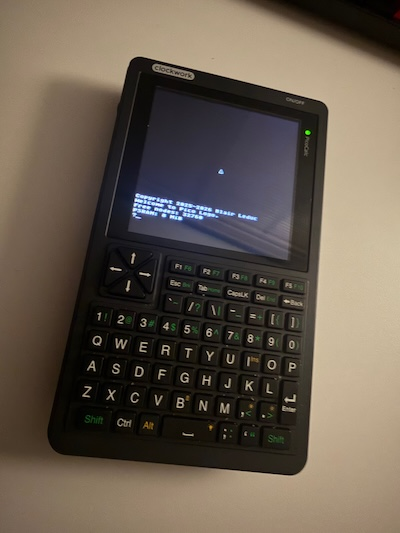
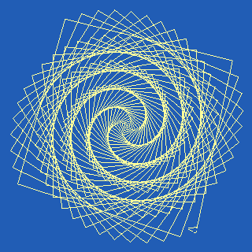
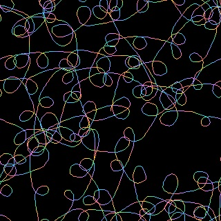
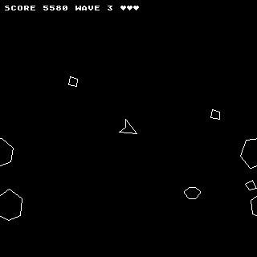
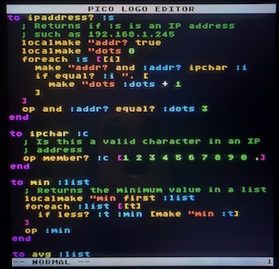
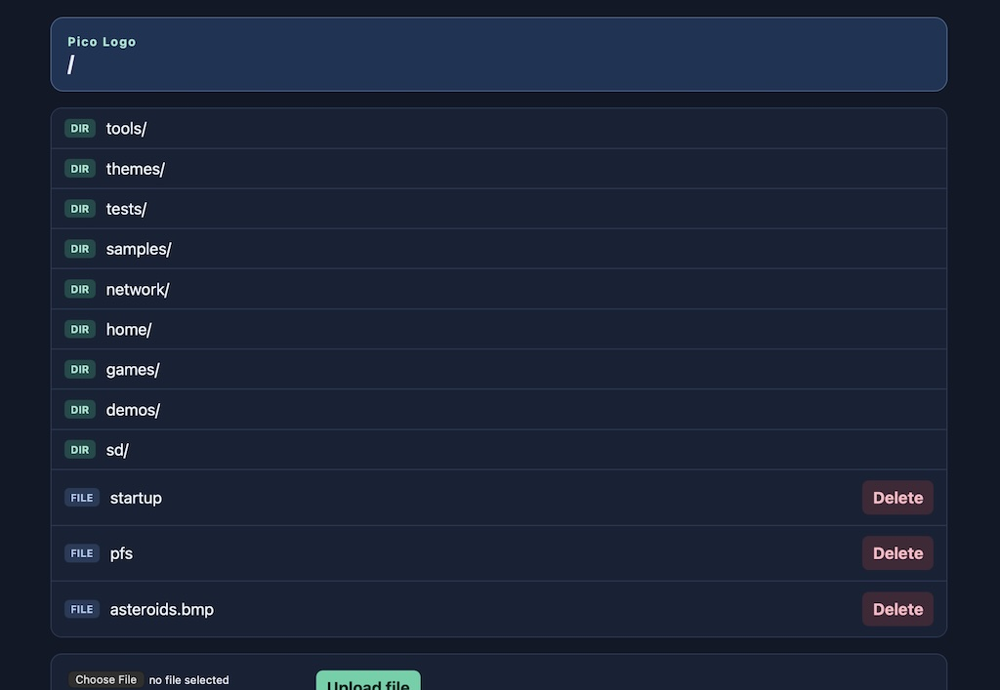

# Pico Logo

**A complete Logo machine for the [PicoCalc](https://www.clockworkpi.com/picocalc).**

<!-- SHOT: hero -->


Flash it, turn the PicoCalc on, and you are at a `?` prompt. Everything you need
is in the device: the language, a full-screen editor, a filesystem, turtle
graphics, sprites, sound, and — on a wireless board — the network. There is no
host computer in the loop, no toolchain, and nothing to install on the SD card
after the first boot. It is the 1983 experience of sitting down in front of a
computer that is ready to be programmed, on hardware that fits in your hand.



```logo
repeat 220 [ fd repcount rt 88 ]
```

Pico Logo follows the LCSI dialect (Apple Logo II is the model), with
influences from MIT and Berkeley Logo, so the Logo books of the 1980s and
1990s work here with little or no modification. It is written in C11 for the
RP2350, and there are **more than 350 primitives**, all of them documented in
the [Pico Logo Reference](reference/Pico_Logo_Reference.md).


## Install

1. Download the UF2 for your board and the `logo.img` file from the
   [Releases](https://github.com/BlairLeduc/pico-logo/releases) page.
2. Copy `logo.img` to the root of an SD card and insert it into the PicoCalc.
3. With the PicoCalc off, hold the BOOTSEL button (reachable through the back)
   while plugging a USB cable into the Pico's USB port — the one nearest the
   bottom of the device.
4. Release BOOTSEL once `RPI-RP2` appears as a drive, and drag the UF2 onto it.
5. Unplug, turn the PicoCalc on, and at the prompt run `.restore "/sd/logo.img`
   to lay down the factory filesystem — the games, demos, samples and editor
   themes described below.

```
Copyright 2025-2026 Blair Leduc
Welcome to Pico Logo.
?_
```

Full details, including how to restore the filesystem later, are in the
reference manual's [Installation](reference/Pico_Logo_Reference.md#installation)
chapter.


## A tour

### The language

Classic Logo, taken seriously. Words and lists, dynamically scoped variables,
procedures you can inspect and edit while they run, `if`/`ifelse`/`test`,
`repeat`/`repcount`/`forever`/`while`/`until`, `run` and `runresult`,
`catch`/`throw`, and `trace`/`step` for watching what your program actually
does.

- **Tail call optimisation** — a self tail-recursive call reuses its frame, so
  recursive loops run in constant space and never hit the recursion limit.
- **List processing** — `apply`, `foreach`, `map`, `map.se`, `filter`, `find`,
  `reduce` and `crossmap`, with named lambdas rather than `?` templates.
- **Property lists** — `pprop`/`gprop`/`plist`/`remprop` hang key-value data
  off any name.
- **Bitwise arithmetic** — `bitand`, `bitor`, `bitxor`, `bitnot`, `ashift`,
  `lshift`, for the bit-twiddling a game ends up wanting.
- **Workspace tools** — `po`/`pot`/`pon`/`pops` to print things out,
  `bury`/`unbury` to keep your own utilities out of the way, `nodes`/`atoms`
  and `recycle` to see and reclaim storage.
- **Built-in help** — `help "fput` explains a primitive and its inputs; give it
  a word that isn't one and it searches every name and description for you;
  `(help)` lists every primitive by manual chapter. Misspell a procedure name
  and Logo suggests what you probably meant.
- **Single-precision floats**, hardware-accelerated on the RP2350.

### Turtle graphics

<!-- SHOT: graphics -->


320×320 pixels, 256 colours on screen chosen from a palette of 65,536 — and
every palette slot is yours to change with `setpalette`/`palette`/
`restorepalette`.

- `fd`/`bk`/`rt`/`lt`/`seth`/`setpos` and the rest, plus `arc`, `dot`, `fill`,
  `clean`, `stamp` and `write` (text drawn at the turtle, in the pen colour).
- Pen sizes 1–32 (`setpensize`), pen modes including `penerase` and
  `penreverse`, and `dot?` to ask what colour a pixel is.
- `window`, `wrap` and `fence` edge behaviour.
- `loadpic`/`savepic` to keep a drawing on disk.
- Three screen modes — full-screen text, full-screen graphics, and a split
  screen with graphics above and eight lines of text below — switched with
  `textscreen`/`splitscreen`/`fullscreen` or the `F1`–`F3` keys, at the prompt
  or from inside a running program.
- `refresh`/`refreshmode`/`sync` for hand control over when the screen is
  redrawn, which is what makes a smooth game frame possible.

### Eight turtles, and games

<!-- SHOT: game -->


There are eight live turtles. `tell`, `ask`, `each` and `who` address them
individually or as a set; each can wear a bitmap or full-colour **costume**,
scale and rotate it, move and animate autonomously (`setspeed`, `setanim`)
while your program does something else, and collide pixel-accurately
(`touching?`, `over?`, `colourunder`, `distance`).

**Tile maps** build worlds too big to draw square by square: `newtiles` and
`snaptile` fill a bank of 8×8 or 16×16 tiles picked up off the screen,
`newmap`/`settile`/`tile` hold the world as one byte per square — up to
512×512 on a PSRAM board — and `stampmap`/`stamptile` paint it. The map is not
just a picture; it is the thing your program asks "what is here?".

For input, `pollkeys` samples the whole keyboard at once and `keydown?` /
`keyhit?` answer from that snapshot, so a game can tell *held* from *pressed*
and read several keys in the same frame.

### Sound

An eight-voice stereo PSG synthesizer: three tone voices and one noise voice
per ear, each with its own waveform (`setwave`) and ADSR envelope (`setenv`).
`toot` is the one-liner, `sound` fires a note and returns immediately, and
`play` queues a background melody in note notation that goes on playing while
your program runs.

### The editor

<!-- SHOT: editor -->


A full-screen editor for procedures, variables and files (`edit`, `edall`,
`edn`, `editfile`), with Logo syntax highlighting — keywords, procedure names,
variables, strings, numbers, comments, and rainbow bracket-depth colouring —
plus incremental search and replace. Nine colour themes ship with it
(Dracula, Monokai, One Dark, Ayu, Cobalt2, GitHub, Dark+, and more); load one
with `load "/themes/dracula.theme`.

`setvimode true` turns on a modal vi layer over the same editor: operators and
motions with counts, text objects (`diw`, `ci[`, `da(` — the group is the unit
a Logo program is edited in), visual mode, `/` search and `:%s` substitution,
undo, and `.` to repeat the last change, including a repeated insert.

At the prompt itself you get full line editing and history.

### Files

An internal LittleFS filesystem at `/` (2 MB, or 8 MB on a 16 MB board) and a
FAT32 SD card mounted at `/sd`, with `catalog`/`cat`, `files`, `directories`,
`createdir`, `setprefix`, `rename`, `copyfile`, `erasefile` and `free`.
`load`/`save` move Logo programs; `open`/`reader`/`writer`/`setread`/`setwrite`
give you streams; `dribble` records a whole session to a file; `backup` and
`.restore` take and replay an image of the internal filesystem.

### Networking

<!-- SHOT: network -->


On a wireless board: `wifi.connect`, or the non-blocking `wifi.start` /
`wifi.status` pair so a startup file reaches the prompt straight away;
`wifi.scan`, `network.resolve`, `network.ntp` to set the clock, and
`network.ping`.

An HTTP **client** — `http.get`, `http.post`, `http.put`, `http.patch`,
`http.delete`, with `json.get`/`json.count`/`json.object`/`json.array`/
`json.make` for reading and building JSON — and an HTTP **server**:
`http.listen` plus a `when [http.request?]` demon makes the PicoCalc a web
server answering at `http://picologo.local/`. Plain `http://` works on any
wireless board; `https://` needs PSRAM.

### Events and time

`when` arms a demon that fires the moment a condition turns true — up to eight
at once, running alongside your program or while you sit at the prompt — and
`cleardemons` puts them away. `date`/`time`/`setdate`/`settime` drive a
real-time clock (kept honest over WiFi with `network.ntp`), and `ticks` is a
monotonic millisecond counter for timing a frame.

### The hardware

`hw.battery` reports charge, `hw.temperature` reads the RP2350's own
temperature sensor, `hw.setlight` and `hw.light?` work the little LED on the
processor board, `goodbye` powers down, and `.bootsel` reboots into
the bootloader so the next UF2 is a drag away.


## What comes on the device

`.restore` lays all of this into the filesystem:

**Games** (`/games`) — every one written in Logo, and readable with `po`:

| Game | What it is |
|---|---|
| `asteroids` | The 1979 vector arcade game, drawn as vectors: `fd`/`rt` with the pen down *is* a display list. Rocks, splitting, a shooting saucer, hyperspace, the heartbeat that speeds up as the board thins, and a top-ten score table that survives the power switch. |
| `battlezone` | The 1980 vector tank game, in 3D: a wireframe plain that wraps, cubes and pyramids projected from four ground columns each, a mountain range and a crescent moon at infinity, and two treads on four keys -- `1`/`Q` the left tread, `0`/`P` the right, one key per tread per direction the way the cabinet's two sticks worked. In progress -- the world and the camera are there, the enemy is not. |
| `invaders` | Space Invaders, on the sprite and sound stack. |
| `galaxian` | Diving attackers, with an attract screen and score table. |
| `trails` | An original maze chase themed on the Logo turtle, drawing its whole maze from its own tile map. |
| `temple` | The Snake Temple, after RAX's Oric BASIC 10-liner: a dark labyrinth crawl drawn entirely on the text screen -- no turtle, no sprites, no tiles, just `setcursor` and `type`. |
| `ttt` | Tic-tac-toe, for a quieter afternoon. |

**Demos** (`/demos`) — `graphics` is a tour of sprites, tile maps, collision
and animation; `sound` is a tour of the synthesizer. Both are written to be
read as much as run, and every scene is a procedure you can call on its own.

**Samples** (`/samples`) — `stars` is a short drawing; `webturtle` drives the
turtle from a phone browser; `xkcd2601` is the full transcription of xkcd
#2601, "Instructions".

**Tools** — `pfs`, the Pico Logo File Server: browse, download, upload and
delete files over WiFi from a browser or `curl`. `ping` for reachability, and
`migrate` for moving directories around.

**Themes** (`/themes`) — nine editor colour schemes.


## Which board is inside your PicoCalc?

Pico Logo is built for the PicoCalc, and runs on three RP2350 boards you can
put in it. The language and its limits are the same on all three; what differs
is the radio and the memory.

| | Raspberry Pi Pico 2 | Raspberry Pi Pico 2 W | Pimoroni Pico Plus 2 W |
|---|---|---|---|
| Flash / PSRAM | 4 MB / — | 4 MB / — | 16 MB / 8 MB |
| Internal filesystem | 2 MB | 2 MB | 8 MB |
| Recursion depth | 192 | 128 | 128 |
| Networking | — | WiFi, `http://` | WiFi, `http://` and `https://` |
| HTTP response size | — | ~2 KB | ~512 KB |
| Words over 255 characters | — | — | yes (PSRAM) |
| Editor buffer | 24 KB | 24 KB | 256 KB |
| Vi undo journal | 1 KB | 1 KB | 64 KB |
| Tile bank / map | 4 KB / 64×64 | 4 KB / 64×64 | 255 tiles / 512×512 |

Self tail-recursive calls do not count against the recursion depth.

The Pico Plus 2 W is the one to want. The Pico 2 has no radio, so it is the
offline machine — which for turtle graphics, games and sound is no loss at
all.


# Learn Logo

Start with the included [Pico Logo Reference](reference/Pico_Logo_Reference.md).
Then keep going — basic Logo and turtle graphics from these books work here
with little or no modification.

## Beginning Logo
- [Primarily Logo](https://archive.org/details/primarilylogo/page/n37/mode/2up) by Donna Bearden, Kathleen Martin, Brad Foster
- [Logo for Kids: An Introduction](https://www.snee.com/logo/logo4kids.pdf) by Bob DuCharme
- [The Great Logo Adventure](https://softronix.com/download/tgla.zip) by Jim Muller
- [Introducing Logo](https://archive.org/details/tibook_introducing-logo/) by Peter Ross

## Science with Logo

- [Exploring Language with Logo](https://archive.org/details/exploringlanguag00gold) by E. Paul Goldenberg and Wallace Feurzeig
- [Logo Physics](https://archive.org/details/logo-physics-1985) by James P. Hurley

## Advanced Logo
- [Advanced Logo: A Language for Learning](https://www.routledge.com/Advanced-Logo-A-Language-for-Learning/Friendly/p/book/9780805800746) by Michael Friendly
- [LogoWorks: Challenging Programs in Logo](https://logothings.github.io/logothings/logoworks/Home.html) by Cynthia Solomon, Margaret Minsky, Brian Harvey
- [Turtle Geometry: The Computer as a Medium for Exploring Mathematics](https://direct.mit.edu/books/oa-monograph/4663/Turtle-GeometryThe-Computer-as-a-Medium-for) by Harold Abelson, Andrea diSessa
- <ins>Computer Science Logo Style</ins> by Brian Harvey
  - [Volume 1: Intermediate programming](https://archive.org/details/computersciencel0000harv)
  - [Volume 2: Projects, styles, and techniques](https://archive.org/details/computersciencel02harv)
  - [Volume 3: Advanced Topics](https://archive.org/details/computersciencel03harv)

Many more books are freely available on the internet.


# About Logo
- [Mindstorms](http://worrydream.com/refs/Papert%20-%20Mindstorms%201st%20ed.pdf) by Seymour Papert
- [Logo's Lineage](https://www.atarimagazines.com/v2n12/logoslineage.php) by Ian Chadwick
- [History of Logo](https://escholarship.org/uc/item/1623m1p3) by Cynthia Solomon, Brian Harvey, Ken Kahn, Henry Lieberman, Mark L. Miller, Margaret Minsky, Artemis Papert, Brian Silverman
- [Logo Philosophy and Implementation](http://www.microworlds.com/support/logo-philosophy-implementation.html) by Seymour Papert, Clotilde Fonseca, Geraldine Kozberg and Michael Tempel, Sergei Soprunov and Elena Yakovleva, Horacio C. Reggini, Jeff Richardson, Maria Elizabeth B. Almeida, David Cavallo
- [Logo Tree project](https://web.archive.org/web/20180820132053/http://elica.net/download/papers/LogoTreeProject.pdf) by Pavel Boytchev


# Contributing

Build instructions, the toolchain, the test suite and the release scripts are
in [CONTRIBUTING.md](CONTRIBUTING.md). The design documents behind each major
feature live in [`docs/`](docs/), alongside the
[roadmap](docs/roadmap.md) and the [bug tracker](docs/bugs.md).


## Credits

Pico Logo was created by an experienced software engineer collaborating with
[GitHub Copilot](https://github.com/features/copilot),
[Claude Code](https://claude.com/claude-code), and
[Codex](https://openai.com/codex/).

This is my safe, side open-source project where I experiment with agentic
engineering. I am not making a point on what can be or not be done in this new
world where we find ourselves. This is not an example of vibe coding. I am
applying engineering principles vigorously.


## License

MIT. Copyright 2025-2026 Blair Leduc. See [LICENSE](LICENSE) for details.
