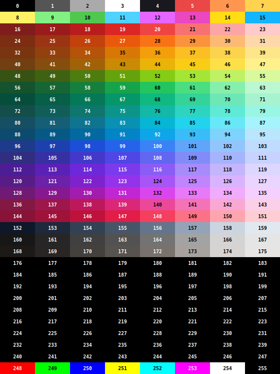

# Colour Palette for Pico Logo

Each row is one hue group from `palette_24bit` (see `devices/palette.h`). The number on each block is the index into this array (0–127). This approximates the 128-colour palette found in the Atari 8‑bit GTIA.

