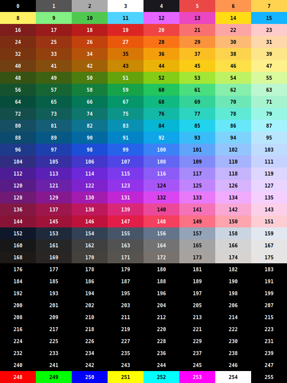

# Pico Logo

## Installation

From the [Releases](https://github.com/BlairLeduc/pico-logo/releases) page, download the UF2 file for your device and the `logo.img` file. On your SD Card, copy the `logo.img` file into the root folder.  

Flash the PicoCalc with the latest release and reboot your PicoCalc:

1. Make sure your PicoCalc is off.
1. Push and hold the BOOTSEL button, accessible through the back of the PicoCalc, while connecting your PicoCalc with a USB cable to a computer. Use the USB port of the Pico, closest to the bottom of the device. 
1. Release the BOOTSEL button once your Pico appears as a mass storage device called `RPI-RP2`.
1. Drag and drop the Pico Logo UF2 file onto the `RPI-RP2` volume. Your Pico will reboot.
1. Disconnect the USB cable and turn on the PicoCalc. You are now running Pico Logo.

You should see:

```
Copyright 2025-2026 Blair Leduc
Welcome to Pico Logo.
?_
```

The question mark, `?` is the _prompt_. When the prompt is on the screen, you can type something. The flashing underscore, `_` is the _cursor_. It appears when Logo wants you to type something and shows where the next character you type will appear.

## Restore the default filesystem

At the prompt, enter:

```
.restore "/sd/logo.img
```

This will format and restore the factory filesystem contents. You can now remove the `logo.img` file from the SD Card.

## References

This reference manual contains content that is collected from:

- [Apple Logo Reference Manual](https://archive.org/details/apple-logo-reference-manual)
- [Apple Logo II Reference Manual](https://archive.org/details/Apple_Logo_II_Reference_Manual_HiRes)
- [Atari Logo Reference Manual](https://archive.org/details/AtariLOGOReferenceManual)
- [Berkeley Logo](https://people.eecs.berkeley.edu/~bh/downloads/ucblogo.pdf)

===

# Contents

{{TOC}}

===

# Introduction

## Logo Programs

A Logo program is a collection of procedures. 

For example, a program to draw a house consists of these procedures: `house`, `box`, `tri`, `right`, `forward`, and `repeat`. Of these, the last three are _primitives_. The first three are user-defined procedures, built out of Logo primitives.

```logo
to house
  box 
  forward 50
  right 30
  tri 50 
end 

to box 
  repeat 4 [forward 50 right 90] 
end

to tri :size
  repeat 3 [forward :size right 120] 
end 
```

We are assuming that you have had some experience with Logo and have built up an intuitive model of what Logo is about. Here we give a more formal model. This model is just another way to think about Logo. It is not meant to replace your current way of thinking, but rather to enhance it. 

## Formal Logo

The actual Logo system is very complicated. It will help if we consider a formal description of Logo, and then Logo as it really is. We begin our formal description by restricting ourselves to a part of Logo, which we'll call _formal Logo_; we then relax the restrictions in order to describe the language you actually use, which we'll call _relaxed Logo_.

Every instruction in formal Logo works without change in relaxed Logo. Conversely, anything that can be done in Logo can be done in formal Logo, but you will immediately recognize situations where formal Logo forces idioms that no one would actually use. For example, if you are experienced in Logo you will notice that numbers look peculiar in formal Logo: they are quoted. Since numbers are words, you can quote them in relaxed Logo as well. But we do so very rarely; in relaxed Logo, numbers are self-quoting.

**Procedures and inputs:** We assume that you know what procedures are, at least on an intuitive level. Here we develop some more precise ways to talk about them. 

In formal Logo, every procedure requires a definite number of inputs. These inputs are always one of two kinds: they may be _words_ or they may be _lists_. They may be given directly, as in `forward "100`, or indirectly through the mediation of another procedure, as in `forward sum "60 “40`. Both of these examples have the same effect. If an input is given directly as a word, it must be preceded by a quote mark, as in `print "forward`. If it is given directly as a list, it is surrounded by square brackets, as in `print [How are you?]`. 

**Words and lists:** A word is made up of characters. A list is made up of elements enclosed in square brackets, with spaces between elements; an element is either a word (without quotes) or a list. 

**Naming things:** The name of a procedure, input, or variable is a word. Logo does not care if a name is in lower or upper case. For example, the following are regarded as being the same:

```logo
forward 100
FORWARD 100
```

The name is remembered using the case that is used in the definition.

**Property Lists:** Any Logo word can have a _property list_ associated with it. A property list consists of an even number of elements. Each pair of elements consists of a property, and its value, a word or a list.

**Expressions:** A procedure name followed by the required number of inputs is an _expression_. More generally, an _expression_ is 

- a quoted word, 
- list, or 
- an (unquoted) procedure name followed by as many expressions as the procedure requires. 

If this seems complicated, look at an example. `repeat` is a procedure that requires two inputs. 

This is an expression:

```logo
repeat "3 [fd 10] 
```

The following is also an expression:

```logo
repeat sum "2 "1 [fd "10]
```

In this case the first input is not a quoted word, but an expression involving another procedure, `sum`. 

The following is also an expression:

```logo
repeat sum "3 "1 sentence "fd "10 
```

**Commands and operations:** There are two kinds of procedures in Logo. Those (like `sum`) that produce a Logo object are called _operations_. The others (like `print`) are called _commands_. 

With these definitions we can define a Logo instruction.

A Logo _instruction_ is a particular kind of expression. It starts with a procedure name, and that procedure must be a command. All other procedures in the expression must be operations. 

Why does it matter whether an expression is an instruction or not? Consider

```logo
sum "3 "4 
```

This is an expression, but it is not a Logo instruction.

`sum` will produce a number; but simply writing `sum "3 "4` does not state what is to be done with the number. In fact, Logo will give an error message saying `I don't know what to do with 7`. Some programming languages would allow this and simply print the `7`. In designing Logo we preferred to make every important act explicit; if you want something to be printed you should say so. 

## Relaxed Logo

Everything that can be done in Logo can be done using formal Logo. But we have allowed some other idioms, either to make the language feel more natural or to eliminate large amounts of typing.

Here we list some important relaxations of Logo. Others are mentioned in the body of the manual. See also [Parsing](#appendix-b-parsing). 

**Numbers:** In formal Logo, all words used as direct inputs, including numbers, must be quoted. In relaxed Logo, numbers are self-quoting: the quote marks are unnecessary. For example, 

```logo
sum 3 4 
```

A _number_ is a word made up of digits; it may also contain a minus sign, a period, and an `E` or `N`. See (Arithmetic Operations)[#arithmetic-operations].

```logo
?print 1e4
10000
?print 1n4
0.0001
```

**Infix procedures:** Formal Logo uses only prefix procedures. Thus addition is expressed by `sum "3 “4`. In relaxed Logo you can also use the infix form `3 + 4`. Similarly with multiplication, subtraction, and division. See [Arithmetic Operations](#arithmetic-operations). 

**Variable number of inputs:** In formal Logo, every procedure has a fixed number of inputs. In relaxed Logo, several procedures can have variable numbers of inputs. When you use other than the 
expected number of inputs you must enclose the expression in parentheses: 

```logo
(sum 3 4 5 6 7 8) 
```

**Dots:** A familiar feature of relaxed Logo is the use of dots (`:`). In formal Logo, `:x` is written as `thing "x`. 

**Parentheses for grouping:** Logo has parentheses so that you can explicitly tell Logo how to Group 
things. For example, consider 

```logo
25 + 20 / 5
```

Should the addition be done first, producing `9`, or should the division be done first, producing `29`? Relaxed Logo follows the traditional mathematical hierarchy, in which multiplication and division are done before addition and subtraction; thus this operation first divides `20` by `5`, and produces `29`. To group the numbers so that addition is done first, parentheses must be used: 

```logo
(25 + 20) / 5 
```

**Commands and operations:** In formal Logo, a given procedure is either a command or an operation, not both. In relaxed Logo, a procedure can be sometimes a command and sometimes an operation. [`run`](#run) and [`if`](#if) are examples of this. See [Conditionals and Control of Flow](#conditionals-and-control-of-flow). 

**The command `to`:** In formal Logo, you define a procedure with the command `define`; it takes two inputs, a word (the procedure name) and a list (the definition). All the usual rules about quotes and brackets apply without exception:

```logo
define "square [ [ ] [ repeat 4 [ fd 100 rt 90 ] ] ] 
```

In relaxed Logo, you can define a procedure with `edit` and `to`. The command `to` is unusual in two ways. It automatically quotes its inputs, and it allows you to type in the lines of the procedure interactively: 

```logo
?to square :size
>repeat 4 [fd :size rt 90] 
>end
``` 

As shown, when interactively defining a procedure using the command `to`, the prompt changes to `>` until a line starting with `end` is encountered ending the definition of the procedure. This provides feedback that you are in the middle of defining a procedure and is the only time when this prompt is used.

## A Further Note on Operations 

In talking about formal Logo we have been using the word _produce_: a procedure _produces_ an object (called the _output_ of the procedure). In traditional Logo terminology we say that the procedure _outputs_ an object. 


## Logo Objects 

There are two types of Logo _things_ (or _objects_): _words_ and _lists_. 

A word, such as `television` or `617`, is made up of characters (letters, digits, punctuation). A number is a kind of word.

A list, such as `[rabbits television 7 [ears feet]]`, is made up of Logo objects, each of which can be either a word or a list. See [Words and Lists](#words-and-lists). 

## Variables: Some General Information

A _variable_ is a container that holds a Logo object. The container has a name and a value. The object held in the container is called the variable's _value_. You create a variable in one of two ways: either by using the `make` or `name` command, or by using procedure inputs.

Logo has two kinds of variables: local variables and global variables. Variables used as procedure inputs are local to that procedure. They exist only as long as the procedure is running, and will disappear from your workspace after the procedure stops running.

Normally a variable created by `make` is a global variable. The `local` command lets you change those variables into local variables. This can be very useful if you want to avoid cluttering up your workspace with unwanted variables.

```logo
to yesno: question
  local "answer
  pr :question
  make "answer first readlist
  if equal? :answer "yes [ output true ]
  output false
end
```

## How You Might Think about Quotes 

The role of quotes is best understood through the following example:

```logo
?print "heading
heading
?print heading 
180
``` 

In the first case the quotation mark (`"`) indicates that the word `heading` itself is the input to `print`.

In the second case the input is not quoted. It is therefore interpreted as a procedure, which provides the input to `print`. 

## How You Might Think about MAKE

The effect of the command

```logo
make "bird "pigeon
```

can be thought of as follows. A container is given a name: `bird`. The word `pigeon` is put into the container.

Once this is done the operation `thing` has the following effect:

```logo
thing "bird
```

produces `pigeon`.

Dots are similar to `thing`; for example, 

```logo
:bird
```
produces `pigeon`. 

We can talk about the same situation in several ways: 

`bird` is a _variable_; `pigeon` is its _value_. 

`bird` is a _name_ of `pigeon`. 

`bird` is _bound_ to `pigeon`. 

`pigeon` is the _thing_ of `bird`. 

You can change what it is in the container; if you type

```logo
make "bird "sparrow 
```

then the container `bird` contains the word `sparrow` instead of the word `pigeon`. 

## How to Think about Procedures You Define and their Inputs

Procedures you define can have inputs. When you define a procedure, its title line specifies how many inputs it has and a name for each one. The inputs are put into the containers designated on the title line of the procedure definition in the order in which they occur. For example, the following procedure makes the turtle draw various polygons, depending upon what inputs are used. 

```logo
to poly :step :angle
  forward :step 
  right :angle 
  poly :step :angle 
end 
```

Whatever inputs you choose—for example, `50` and `90`—are put into the specified containers. The first input is always put in the container `step`; the second input is always put in the container `angle`. The first input variable, `step`, controls the size of the figure. The second input variable, `angle`, controls the shape of the figure. `poly 50 90` makes the turtle draw a square; `poly 50 144` makes the turtle draw a pentagram; `poly 50 120` makes the turtle draw a triangle. 

If the input containers already have objects in them when the procedure is run, the objects are removed but are saved. They are restored when the procedure is done. In other words, the procedure _borrows_ the container and leaves it in its original condition when done with it. This is what is meant by saying that a variable is _local_ to the procedure within which it occurs. 

For example: 

```logo
?make "sound "crash 
?print :sound 
crash 
```

Now we run a procedure called `animal`; its input variable is `sound`. 

```logo
to animal :sound 
  if :sound = "meow [ pr "Cat stop ] 
  if :sound = "woof [ pr "Dog stop ] 
  pr [ I don't know ] 
end
```

If we type `animal "woof`, then `woof` is put into the `sound` container for the duration of the `animal` procedure. Afterwards, `crash` is restored:

```logo
?make "sound "crash 
?print :sound 
crash
?animal "woof 
Dog 
?print :sound 
crash 
```

## Another Way to Talk about Procedures 

When you use a procedure, we also say that you _call_ that procedure. Procedures you define call other procedures. For example, the `poly` procedure above calls other procedures (`forward` and `right`). 

`poly` also calls itself. This is called a _recursive_ call. 

## Review of Special Characters 

_Quotation marks_, or _quotes_, `”`, used immediately before a word, indicate that it is being used _as a word_, not as the name of a procedure or the value of a variable. 

A _colon_, known as _dots_, `:`, used immediately before a word, indicates that the word is to be taken as the name of a variable and produces the value of that variable. 

_Brackets_, `[` `]`, are used to surround a list.

_Parentheses_, `(` `)`, are necessary to group things in ways that Logo ordinarily would not, and to vary the number of inputs for certain procedures. Both of these uses are described above in this introduction. 

A _backslash_, `\`, tells Logo to interpret the character that follows it literally _as a character_, rather than keeping some special meaning it might have. For instance, suppose you wanted to use `3[a]b` as a single _word_. You need to type `3\[a\]b` in order to avoid Logo’s usual interpretation of the brackets as the envelope around a list. You have to backslash `[`,`(`,`]`,`)`,`+`,`-`,`*`,`/` and `\` itself. 

===

# Difference from other Logo interpreters

Line continuation characters are not supported.

Words with internal spaces are created using the "`\`" character, not using the veritcal bar notation.

Pico Logo does not support the `if predicate list1 list2` form. Use `(if predicate list1 list2)` or `ifelse predicate list1 list2` instead.


===
# Supported Pico Boards

Pico Logo runs on three RP2350-based boards. The interpreter and its limits are
identical on every board; what differs is networking — which needs a wireless
radio — and storage capacity, which depends on the flash and PSRAM fitted.

**Shared by every board** (the RP2350 processor):

- 32768 nodes for procedure and variable storage
- 24576 characters of editor buffer
- 8192 characters in the copy buffer
- Hardware floating-point operations

**Raspberry Pi Pico 2** — 4 MB flash, no radio.

- 192 levels of recursion
- 2 MB internal filesystem
- No networking

**Raspberry Pi Pico 2 W** — 4 MB flash, WiFi, no PSRAM.

- 128 levels of recursion
- 2 MB internal filesystem
- WiFi (`wifi.connect`, `wifi.scan`, …) with `network.resolve`, `network.ntp` and `network.ping`
- `http.get` and `http.post` over `http://` only; `https://` is not available, so `tls?` outputs `false`
- HTTP responses are limited to about 2 KB (there is no PSRAM to hold a larger body)

**Pimoroni Pico Plus 2 W** — 16 MB flash, 8 MB PSRAM, WiFi.

- 128 levels of recursion
- 8 MB internal filesystem
- WiFi (`wifi.connect`, `wifi.scan`, …) with `network.resolve`, `network.ntp` and `network.ping`
- `http.get` and `http.post` over both `http://` and `https://`, so `tls?` outputs `true`
- HTTP responses up to about 512 KB, held in PSRAM


===
# Startup

This section describes the feature of Logo that lets you automatically load a file into your workspace when you start up Logo. You must call the file `startup`. There can be only one file with the name `startup`, although it can include commands to load other files.

The default prefix is `/`, the root of the device's internal storage, so the `startup` file is located at `/startup`. You can change the `startup` file, with [`editfile`](#editfile).

```logo
>editfile "startup
```

You can [`bury`](#bury) procedures and [`buryname`](#buryname) variables created in your `startup` file (using the `startup` variable!) so they are not a distraction. [`buryall`](#buryall) is a good approach.

For example:

```logo
?erall
?to welcome
>pr [Hello there!]
>end
?make "startup [welcome buryall]
?save "startup
```

You also erase procedures and variables that are only needed for startup processing (see [`erase`](#erase-er) and [`ern`](#ern)).


===
# Using the Logo Editor

The Logo Editor is an interactive screen-oriented text editor, which provides a flexible way to define and change Logo instructions. The main command for starting up the Logo Editor is [`edit`](#edit-ed).

## How the editor works

When you call the Editor, Logo changes the screen. The editor uses the entire screen with the header:

`PICO LOGO EDITOR`

centred on the top row (the top row is reverse video). The bottom line has centred in reverse video

`ESC - ACCEPT    BRK - CANCEL`

The content you edit is on the 30 lines between the top and bottom rows. There is no prompt character, but the cursor shows where you are typing.

The text that you edit is in an area of memory called a **buffer**. When you enter the Editor, Logo displays the text from the edit buffer, up to 30 lines per screen.

You can move the cursor anywhere in the text using the cursor control keys described later in this section. You can also delete and insert characters using the appropriate keys.

Each key that you type makes the Editor take some action. Most typewriter characters (letters, numbers, punctuation, and `Enter`) are simply inserted into the buffer at the place marked on the screen by the cursor.

When you press `Enter`, the cursor (and any text that comes after it) moves to the next line, ready for you to continue typing.

You can have more characters on a line of text than fit across the screen. When you get to the end of the line on the screen, just continue typing without pressing `Enter`. The screen will scroll horizontally to show the rest of the line.

The Editor has an auxiliary line buffer called the copy buffer. You can use it to move text in a procedure or to repeat them in different places. The copy buffer can hold a [`limited number of characters`](#processor-limits). While this is true for the copy buffer, the length of a line is limited only by the [`length of the edit buffer`](#processor-limits).

## Editing actions

When you are in the editor, you can use the following editing keys:

### Cursor motion

- `←` - moves the cursor one character to the left
- `→` - moves the cursor one character to the right
- `↑` - moves the cursor up to the previous line at the same column
- `↓` - moves the cursor down to the next line at the same column
- `Home` - toggles the cursor between the first non-whitespace character and the beginning of the line
- `End` - moves the cursor to the end of the line
- `Shift` `↑` - moves the cursor to the previous page
- `Shift` `↓` - moves the cursor to the next page

The cursor will not move if that position is not valid.

### Inserting and deleting

- `Enter` - creates a new line at the current cursor position and moves the cursor (and any text that comes after it) to the new line
- `←Back` - erases the character to the left of the cursor
- `Del` - erases the character at the cursor position
- `Tab` - inserts spaces until the next tab stop (tab stops are every 2 columns)
- `Ctrl` `X` or `Ctrl` `T` - erases (or takes) the current line and stores the text in the copy buffer, including the new line
- `Ctrl` `C` or `Ctrl` `Y` - copies (or yanks) the current line and stores the text in the copy buffer, including the new line
- `Ctrl` `V` or `Ctrl` `P` - inserts (or pastes) the text in the copy buffer at the cursor position

### Block editing

Selected text is between the start anchor and the cursor and is shown in reverse video. The character at the cursor is not included in the selection. `Ctrl` `B` sets the start anchor at the cursor position. Pressing `Ctrl` `B` when the start anchor is set removes the start anchor and cancels the selection. The cursor motion keys are used to select text when the start anchor is set.

- `Del` or `←Back` - erases the selected text without storing the text in the copy buffer
- `Ctrl` `X` or `Ctrl` `T` - erases (or takes) the selected text and stores the text in the copy buffer
- `Ctrl` `C` or `Ctrl` `Y` - copies (or yanks) the selected text and stores the text in the copy buffer
- `Ctrl` `V` or `Ctrl` `P` - replaces (or pastes over) the selected text with the text in the copy buffer.
- `Ctrl` `,` - decreases the indent of the block by one tab stop
- `Ctrl` `.` - increases the indent of the block by one tab stop


Typing any other key (except `Esc` or `Brk`) is ignored while the selection of text is active.

### Viewing screens

`F3` lets you see temporarily the graphics screen and its most recent contents. `F1` restores the screen back to the Editor so you can pick up where you left off.

### Exiting the editor

When you exit from the Editor using `Esc`, Logo reads each
line in the edit buffer as if you had typed it directly from top level.

If the instructions in the edit buffer define a procedure (that is, if there is a title line `to` ... that starts the definition), Logo behaves as though you had typed the definition of the procedure using `to`. If the buffer contains a procedure definition, but there is no `end` instruction at the end of the buffer, Logo helps out by ending the definition for you.

If there are Logo instructions on lines in the edit buffer that are part of the definition of a procedure, Logo caries them out when you exit the editor. Logo will not carry out any graphics commands or editing commands.

In the Editor, you may define more than one procedure at a
time as long as each procedure is terminated by `end`.

Exiting the editor using `Brk`, Logo does not read any lines in the edit buffer. If you were defining a procedure, the definition will be the same before you started editing.


## edit (ed)

edit _name_  
edit _namelist_  
ed _name_  
ed _namelist_  
(edit)  
(ed)  

`command`

Starts the Pico Logo Editor. Starts the Logo Editor with the procedure named _name_ (or procedures in the list _namelist_) and their definitions in it. This is the same output as [`pops`](#pops). 

If `edit` does not have an input the current contents of the buffer are used.

**Example**:

```logo
?to rink  pr [Zamboni break]  end
?edit "rink
; Opens the editor with the rink procedure
```


## edall

edall

`command`

Starts the Pico Logo Editor with all procedures and variables. Procedures are formatted using [`to`](#to)/[`end`](#end) syntax, variables as [`make`](#make) commands, and property lists as [`pprop`](#pprop) commands. This is the same output as [`poall`](#poall). The format ensures that when you exit the editor, all definitions can be re-executed to recreate the workspace state.

**Example**:

```logo
?make "snack "butter\ tart
?to pack  pr [Packed:] pr :snack  end
?edall
; Opens the editor with all procedures and variables
```


## edn

edn _name_  
edn _namelist_


`command`

Stands for `ed`it `n`ame (name must be quoted). Starts the Logo Editor with the variable named _name_ (or variables in the list _namelist_) and their values in it. This is the same output as [`pon`](#pon). When you exit the editor the [`make`](#make) are run, so whatever variables and values have been changed in the editor are changed in Logo.

**Example**:

```logo
?make "snack "ketchup\ chips
?edn "snack
; Opens the editor with: make "snack "ketchup\ chips
```


## edns

edns

`command`

Stands for `ed`it `n`ame`s`. Starts the Logo Editor with all the names and their values in it. This is the same output as [`pons`](#pons). When you exit the editor the [`make`](#make) are run, so whatever variables and values have been changed in the editor are changed in Logo.

**Example**:

```logo
?make "snack "ketchup\ chips
?make "temp -17
?edns
; Opens the editor with all variables
```


## to

to _name_ _input1_ _input2_ ...

`command`

`to` tells Logo you are defining a procedure called _name_ with the inputs (if any) as indicated. From top level, the prompt character changes from `?` to `>` to remind you that you are defining a procedure. While you are defining a procedure, Logo does not carry out the instructions.

> You need not put a quotation mark before name because TO puts one there automatically.

To complete the procedure and return Logo to top level, type the word [`end`](#end) as the last line of the procedure. The special
word [`end`](#end) must be used alone on the last line.

If you change your mind while defining a procedure with `to`,
press `Brk` to stop the definition. 

**Example**:

```logo
?to square :size
>repeat 4 [fd :size rt 90]
>end
```

## end

end

`command`

`end` is necessary, when you are using [`to`](#to), to tell Logo that you are done defining a procedure. It must be on a line by itself. `end` also must be used to separate procedures when defining multiple procedures in the Logo Editor.

**Example**:

```logo
?to announce :thing
>pr se [Freshly zambonied] :thing
>end
?announce "ice
Freshly zambonied ice
```


===
# Turtle Graphics

Pico Logo has two kinds of screens: the graphics screen and the text screen. When you use any primitive or procedure that renders to the turtle, Logo shows you the graphics screen. The commands [`fullscreen`](#fullscreen-fs), [`splitscreen`](#splitscreen-ss), and [`textscreen`](#textscreen-ts) allow you to switch between the two kinds of screens.

The screen limits are 320 turtle steps high and 320 steps wide. Hence, when using Cartesian coordinates (as in [`setpos`](#setpos)), you reach the edge of the screen when the y-coordinate is 160 (top) or -159 (bottom) and the x-coordinate is -159 (left edge) or 160 (right edge). 


## back (bk)

back _distance_  
bk _distance_   

`command`

The `back` command moves the turtle _distance_ steps back. Its heading does not change. If the pen is down, Logo draws a line the specified _distance_.

**Example**:

```logo
?bk 50
```


## clearscreen (cs)

clearscreen  
cs

`command`

`clearscreen` erases the graphics screen, puts the turtle in the center of the screen, and sets the turtle's heading too (north). The center of the screen is position [0 0] and is called the **home position**.

**Example**:

```logo
?cs
```


## forward (fd)

forward _distance_  
fd _distance_

`command`

`forward` moves the turtle forward _distance_ steps in the direction in which it is heading. If the pen is down, Logo draws a line the specified _distance_.

**Example**:

```logo
; Draw a maple-leaf stem
?fd 100
```


## getsh

getsh _shapenumber_  

`operation`

Outputs a list of 16 numbers representing the turtle shape _shapenumber_ (an integer between 1 and 15). Note that shape number cannot be 0. Each shape consists of 8 columns by 16 rows. Each element in the list is the sum of the bit values for a row in the shape.

The first element of the list is the first row of the shape. If the whole row is filled in, the number is 255. If the row is empty, the number is 0. If only the right-most position is filled, the number is 1. If only the fifth position is filled, the number is 16.

```logo
>getsh 3
24 60 126 90 90 90 126 231 189 189 165 36 36 36 102 0
```


## hideturtle (ht)

hideturtle  
ht

`command`

`hideturtle` makes the turtle invisible. (The turtle draws faster when it is hidden.)

**Example**:

```logo
?ht
?repeat 4 [fd 50 rt 90]
```


## home

home  

`command`

The `home` command moves the turtle to the center of the screen and sets its heading to 0. If the pen is down, Logo draws a line to the new position. The `home` command is equivalent to

```logo
setpos [0 0]
setheading 0
```


## left (lt)

left _degrees_  
lt _degrees_

`command`

The `left` command turns the turtle left (counterclockwise) the specified number of degrees. The number of degrees must not be greater than approximately 3.4e38, the maximum value for a (32-bit) IEEE 754 floating point number.

**Example**:

```logo
; Turn to face west
?lt 90
```


## putsh

putsh _shapenumber_ _shapespec_

`command`

Gives _shapenumber_ the specified _shapespec_ as its shape. The output of [`getsh`](#getsh) can be the input of `putsh`. _shapenumber_ is in the range of 1 to 15. Shape 0 cannot be changed.

```logo
>putsh 1 [8 28 28 8 93 127 62 127 127 127 127 127 62 62 93 65]
>setsh 1
```

See [`getsh`](#getsh) to learn about _shapespec_.


## right (rt)

right _degrees_  
rt _degrees_

`command`

The `right` command turns the turtle right (clockwise) the specified number of degrees. The number of degrees must not be greater than than approximately 3.4e38, the maximum value for a (32-bit) IEEE 754 floating point number.

**Example**:

```logo
; Draw an equilateral triangle
?repeat 3 [fd 80 rt 120]
```


## setheading (seth)

setheading _degrees_  
seth _degrees_

`command`

`setheading` turns the turtle so that it is heading in the direction _degrees_, which can be any decimal number less than than approximately 3.4e38, the maximum value for a (32-bit) IEEE 754 floating point number. Positive numbers are clockwise from north, negative numbers are counterclockwise from north. Note that [`right`](#right-rt) and [`left`](#left-lt) do relative motion, but `setheading` does absolute motion.

**Example**:

```logo
; Face west (towards British Columbia from Ontario)
?seth 270
?fd 100
```


## setpos 

setpos [_xcor_ _ycor_]  

`command`

The `setpos` (for set position) command moves the turtle to the indicated coordinates. If the pen is down, Logo draws a line to the new position.

**Example**:

```logo
; Move to the top of the screen (representing north)
?pu
?setpos [0 100]
?pd
```


## setsh

setsh _shapenumber_

`command`

Stands for `set sh`ape. Sets the shape of the current turtle to the shape specified by _shapenumber_ which must be in the range 1 to 15. You can create your own shape using [`putsh`](#putsh). Shapes 1 through 15 are blank when Logo starts.

**Example**:

```logo
?setsh 1
```


## setx

setx _xcor_  

`command`

`setx` moves the turtle horizontally to a point with x-coordinate _xcor_. The y-coordinate is unchanged. If the pen is down, Logo draws a line to the new position.

**Example**:

```logo
; Draw a horizontal line across the centre of the screen
?setpos [-159 0]
?pd
?setx 160
```


## sety

sety _ycor_  

`command`

`sety` moves the turtle vertically to a point with y-coordinate _ycor_. The x-coordinate is unchanged. If the pen is down, Logo draws a line to the new position.

**Example**:

```logo
; Draw a vertical line (like a flagpole)
?setpos [0 -100]
?pd
?sety 100
```


## shape

shape

`operation`

Output the shape number of the current turtle. The normal turtle shape is 0. 

**Example**:

```logo
?pr shape
0
```


## showturtle (st)

showturtle  
st  

`command`

`showturtle` makes the turtle visible. See [`hideturtle`](#hideturtle-ht). 

**Example**:

```logo
?ht
?repeat 4 [fd 50 rt 90]
?st
```


## heading

heading  

`operation`

`heading` outputs the turtle's heading, a decimal number greater than or equal to 0 and less than 360. Logo follows the compass system where north is a heading of 0 degrees, east 90, south 180, and west 270. When you start up Logo, the turtle has a heading of 0 (straight up).

**Example**:

```logo
?seth 90
?pr heading
90
```


## pos

pos

`operation`

`pos` (for position) outputs the coordinates of the current position of the turtle in the form of a list `[xcor ycor]`. When you start up Logo, the turtle is at `[0 0]`, the centre of the turtle field.

**Example**:

```logo
?setpos [50 80]
?show pos
[50 80]
```


## shown? (shownp)

shown?  
shownp  

`operation`

`shown?` outputs `true` if the turtle is not hidden, `false` otherwise.

**Example**:

```logo
?pr shown?
true
?ht
?pr shown?
false
```


## towards

towards [_xcor_ _ycor_]  

`operation`

`towards` outputs a heading that would make the turtle face in the direction indicated by [_xcor_ _ycor_].

**Example**:

```logo
; What heading points from home toward the west coast ferry?
?home
?pr towards [-100 0]
270
```


## xcor

xcor  

`operation`

`xcor` outputs the x-coordinate of the current position of the turtle.

**Example**:

```logo
?setpos [45 80]
?pr xcor
45
```


## ycor

ycor  

`operation`

`ycor` outputs the y-coordinate of the current position of the turtle.

**Example**:

```logo
?setpos [45 80]
?pr ycor
80
```


## clean

clean  

`operation`

The `clean` command erases the graphics screen but doesn't affect the turtle.

**Example**:

```logo
?repeat 4 [fd 60 rt 90]
?clean
```


## dot

dot [_xcor_ _ycor_]  

`command`

The `dot` command puts a dot of the current pen colour at the specified coordinates, without moving the turtle. It does not draw a line, even if the pen is down.

**Example**:

```logo
; Mark the centre of the screen (home position)
?dot [0 0]
```


## fence

fence

`command`

The `fence` command fences in the turtle within the edges of the screen. If you try to move the turtle beyond the edges of the screen, an error, "Turtle out of bounds" occurs and the turtle does not move. If the turtle is already out of bounds, Logo repositions it at its home position [0 0].

See [`window`](#window) and [`wrap`](#wrap).

**Example**:

```logo
?fence
?fd 1000
Turtle out of bounds
```


## fill

fill  

`command`

The `fill` command fills the shape outlined by the current pen colour with the current pen colour. If the turtle is not enclosed, the background is filled with the current pen colour. Logo ignores lines of colours other than the current pen colour when determining what to fill.

**Example**:

```logo
; Draw and fill a square (like a red maple leaf background)
?setpc 4
?repeat 4 [fd 60 rt 90]
?fill
```


## pendown (pd)

pendown  
pd 

`command`

The `pendown` command puts the turtle's pen down. When the turtle moves, it draws lines in the current pen colour. When you start up Logo, the pen is down.

**Example**:

```logo
?pu
?setpos [0 0]
?pd
?fd 80
```


## penerase (pe)

penerase  
pe  

`command`

`penerase` puts the turtle's eraser down. When the turtle moves, it erases lines it passes over. To take away the eraser, use either [`pendown`](#pendown-pd) or [`penup`](#penup-pu).

**Example**:

```logo
; Draw then erase part of a line
?fd 80
?pe
?bk 40
?pd
```


## penreverse (px)

penreverse  
px  

`command`

`penreverse` puts the reversing pen down. When the turtle moves, it tries to interchange the pen colour and background colour, drawing where there aren't lines and erasing where there are. The exact effect of this reversal is complex; what it looks like on the screen depends on the pen colour, background colour, and whether lines are horizontal or vertical. The best results are on a black background.

**Example**:

```logo
?px
?repeat 4 [fd 60 rt 90]
?pd
```


## penup (pu)

penup  
pu

`command`

The `penup` command lifts the pen up: when the turtle moves, it does not draw lines. The turtle cannot draw until the pen is put down again.

**Example**:

```logo
; Reposition turtle without drawing
?pu
?setpos [50 50]
?pd
```


## setbg

setbg _colournumber_  

`command`

The `setbg` (for set background) command sets the background colour to the colour represented by _colournumber_, where _colournumber_ is a value between 0 and 254. The backgound colour is used for the background of the full graphics screen and not for the text screen. To set the background colour for text see [`settextcolor`](#settextcolor-settc).

The background colour number is 255. The default background colour number is 0.

See [Colours](#appendix-e-colour-palette-for-pico-logo) for the default palette.

**Example**:

```logo
; Set a red background for the stop sign you nearly missed
?setbg 4
```


## setpc (setpencolor)

setpc _colournumber_  

`command`

The `setpc` (for set pencolor) command sets the color of the pen to _colourumber_, where _colournumber_ is a value between 0 and 255. 

See [Colours](#appendix-e-colour-palette-for-pico-logo) for the default palette.

**Example**:

```logo
; Draw in red (maple leaf red)
?setpc 4
?repeat 4 [fd 60 rt 90]
```


## settextcolor (settc)

settextcolor [_foreground_ _background_]  
settc [_foreground_ _background_]

`command`

The `settextcolor` command sets the _foreground_ and _background_ colours for text. The input is a list of two colour numbers, where each colour number is a value between 0 and 15. 

See [Colours](#appendix-e-colour-palette-for-pico-logo) for the default palette.

**Example**:

```logo
; White text on red background
?settc [15 4]
?pr [Depot open at dawn]
```


## setpalette

setpalette _colournumber_ _list_

`command`

`setpalette` sets the actual colour corresponding to a given _colournumber_ and _colournumber_ must be an integer greater than or equal to 0. The second input is a list of three nonnegative numbers less than 256 specifying the saturation of red, green, and blue in the desired colour.

See [Colours](#appendix-e-colour-palette-for-pico-logo) for the default palette.

**Example**:

```logo
; Define colour 16 as maple-leaf red
?setpalette 16 [196 30 58]
?setpc 16
```


## palette

palette _colournumber_

`operation`

`palette` outputs a list of three nonnegative numbers less than 256 specifying the saturation of red, green, and blue in the colour associated with the given colour number. 

Colour numbers 254 and 255 are the foreground text and background colours.

**Example**:

```logo
?show palette 4
[170 0 0]
```


## restorepalette

restorepalette

`command`

Restores the palette's default colours. This command only restores colour numbers 0 through 127.

**Example**:

```logo
?setpalette 4 [255 0 0]
?restorepalette
```


## window

window  

`command`

The `window` command makes the turtle field unbounded; what you see is a portion of the turtle field as if looking through a small window around the centre of the screen. When the turtle moves beyond the visible bounds of the screen, it continues to move but can't be seen: The screen is 320 turtle steps high and 320 steps wide. The entire turtle field is 32,768 steps high and 32,768 steps wide.

Changing `window` to [`fence`](#fence) or [`wrap`](#wrap) when the turtle is off the screen sends the turtle to its home position `[0 0]`.

See [`fence`](#fence) and [`wrap`](#wrap).

**Example**:

```logo
; Allow the turtle to wander off screen
?window
?fd 500
```


## wrap

wrap  

`command`

The `wrap` command makes the turtle field wrap around the edges of the screen: if the turtle moves beyond one edge of the screen, it continues from the opposite edge. The turtle never leaves the visible bounds of the screen; when it tries to, it wraps around to the other side.

See [`fence`](#fence) and [`window`](#window).

**Example**:

```logo
; The turtle wraps around from right to left edge
?wrap
?fd 1000
```


## background (bg)

background  
bg  

`operation`

`background` outputs a number representing the colour of the background and is a value between 0 and 255. 

See [Colours](#appendix-e-colour-palette-for-pico-logo) for the default palette.

**Example**:

```logo
?setbg 4
?pr background
4
```


## dot? (dotp)

dot? [_xcor_ _ycor_]  
dotp [_xcor_ _ycor_]  

`operation`

The `dot?` operation outputs `true` if there is a dot on the screen at the indicated coordinates. If there is no dot, `dot?` outputs `false`.

**Example**:

```logo
?dot [0 0]
?pr dot? [0 0]
true
```


## pen

pen  

`operation`

`pen` outputs the current state of the turtle's pen. The states are `pendown`, `penerase`, `penup`, and `penreverse`. When the turtle first starts up, `pen` outputs `pendown`.

**Example**:

```logo
?pr pen
pendown
?pu
?pr pen
penup
```


## pencolor (pc)

pencolor  
pc  

`operation`

`pencolor` outputs a number representing the current colour of the pen.

See [Colours](#appendix-e-colour-palette-for-pico-logo) for the default palette.

**Example**:

```logo
?setpc 4
?pr pencolor
4
```


## textcolor (tc)

textcolor  
tc

`operation`

`textcolor` outputs a list of two colour numbers representing the foreground and background colours for text. Each colour number is a value between 0 and 15.

See [Colours](#appendix-e-colour-palette-for-pico-logo) for the default palette.

**Example**:

```logo
?settc [15 4]
?show textcolor
[15 4]
```


===
# Text and Screen Commands

Your PicoCalc has 32 lines of text on the screen, with 40 characters on each line. You can use the screen entirely for text or entirely for graphics. The PicoCalc also lets you use the top 24 lines (240 turtle units) for graphics and the bottom eight for text at the same time. When you start up Logo, the entire screen is available for text. 

There are two ways to change the use of your screen:

- With regular Logo commands, which you can type at top level or insert within procedures ([`fullscreen`](#fullscreen-fs), [`splitscreen`](#splitscreen-ss), and [`textscreen`](#textscreen-ts))
- With special control characters, which are read from the keyboard and obeyed almost immediately (while a procedure continues running); these cannot be placed within procedures (`F1`–textscreen, `F2`–splitscreen, and `F3`–fullscreen).

You always can use the entire text screen and the entire graphics screen at the same time, but you cannot display both at the same time. When you use the `fullscreen` command, the text screen is still there, but you can't see it until you use `textscreen` or `splitscreen`. When you use `textscreen`, the graphics screen is still there, but you can't see it until you use `fullscreen` or `splitscreen`. When you use `splitscreen`, both screens are still there, but you can only see the top 24 lines of the graphics screen (240 turtle units) and the bottom eight lines of the text screen.


## cleartext (ct)

cleartext  
ct  

`command`

`cleartext` clears the entire screen and puts the cursor at the upper-left corner of the text part of the screen. If you have been using the split screen, the cursor is on the eighth line from the bottom.

**Example**:

```logo
?pr [Snow route starts at midnight]
?ct
```


## cursor

cursor

`operation`

`cursor` outputs a list of the column and line numbers of the cursor position. The upper-left corner of the screen is `[0 0]`. The upper-right is `[39 0]`.

See [`setcursor`](#setcursor).

**Example**:

```logo
?setcursor [10 5]
?show cursor
[10 5]
```


## fullscreen (fs)

fullscreen  
fs  

`command`

The `fullscreen` command devotes the entire screen to graphics. Only the turtle field shows; any text you type will be invisible to you, although Logo will still carry out your instructions.

If Logo needs to display an error message while you are using the full graphics screen, Logo splits the screen.

**Example**:

```logo
?fs
?repeat 4 [fd 80 rt 90]
?ts
```


## setcursor

setcursor [_columnnumber_ _linenumber_]  

`command`

`setcursor` sets the cursor to the position indicated by _columnnumber_ and _linenumber_. Lines on the screen are numbered from 0 to 31. Character positions (columns) are numbered from 0 to 39.

**Example**:

```logo
; Position the cursor near the centre of the screen
?setcursor [20 15]
?type "Curling
```


## splitscreen (ss)

splitscreen  
ss  

`command`

`splitscreen` devotes the top 24 lines of the screen to graphics and the bottom eight lines to text.

**Example**:

```logo
?ss
?repeat 4 [fd 80 rt 90]
```


## textscreen (ts)

textscreen  
ts  

`command`

`textscreen` devotes the entire screen to text; the graphics screen is invisible to you until a graphics procedure is run.

**Example**:

```logo
?fs
?repeat 4 [fd 80 rt 90]
?ts
?pr [Back to text mode]
```


===
# Words and Lists

This section describes the primitives that work on two types of objects in Logo: words and lists. With the primitives described in this section, you can

- break words and lists into pieces
- put words and lists together
- examine words and lists
- change the case of words and lists.

## butfirst (bf)

butfirst _object_  
bf _object_

`operation`

`butfirst` outputs all but the first element of _object_. `butfirst` of the empty word or the empty list is an error.

**Examples**:

```logo
?pr butfirst "hello
ello
?show butfirst [a b c d]
[b c d]
```


## butlast (bl)

butlast _object_  
bl _object_

`operation`

`butlast` outputs all but the last element of _object_.

**Examples**:

```logo
?pr butlast "windmills
windmill
?show butlast [a b c d]
[a b c]
```


## first

first _object_

`operation`

`first` outputs the first element of _object_. `first` of the empty word or the empty list is an error. Note that `first` of a word is a single character; `first` of a list can be a word or a list.

**Examples**:

```logo
?pr first "hello
h
?show first [a b c d]
a
```


## replace

replace _integer_ _object_ _value_

`operation`

`replace` returns a new list with the element of _object_ whose position within _object_ corresponds to _integer_ replaced with _value_. For example, if _integer_ is 3, `replace` returns a list with the third element in the object replaced with _value_. _Object_ is a word or a list. An error occurs if _integer_ is greater than the length of _object_ or if _object_ is the empty word or list.

**Examples**:

```logo
?pr replace 2 "dig "u
dug
?show replace 4 [a b c d] "x
[a b c x]
?make "greet "hello
?pr replace 1 :greet uppercase item 1 :greet
Hello
```


## item

item _integer_ _object_

`operation`

`item` outputs the element of _object_ whose position within _object_ corresponds to _integer_. For example, if _integer_ is 3, `item` outputs the third element in the object. _Object_ is a word or a list. An error occurs if _integer_ is greater than the length of _object_ or if _object_ is the empty word or list.

**Examples**:

```logo
?pr item 4 "windmills
d
?show item 2 [a b c d]
b
```


## last

last _object_

`operation`

`last` outputs the last element of _object_. `last` of the empty word or the empty list is an error.

**Examples**:

```logo
?pr last "Maple
e
?show last [a b c d]
d
```


## member

member _object1_ _object2_

`operation`

`member` outputs the part of _object2_ in which _object1_ is the first element. If _object1_ is not an element of _object2_, `member` outputs the empty list or the empty word. This operation is useful for accessing information in a file or for sorting long lists.

**Examples**:

```logo
?show member "b [a b c d]
[b c d]
?pr member "x "example
xample
?show member "x [a b c d]
[]
?pr member ". 3.14159
.14159
```


## fput

fput _object_ _list_

`operation`

The `fput` (for first put) operation outputs a new list formed by putting _object_ at the beginning of _list_.

**Example**:

```logo
?show fput "a [b c d]
[a b c d]
```


## list

list _object1_ _object2_  
(list _object1_ _object2_ _object3_ _object4_ ...)

`operation`

The `list` operation outputs a list whose elements are _object1_, _object2_, and so on.

**Examples**:

```logo
?show (list "d "o "g)
[d o g]
? show list "Hello "there
[Hello there]
```


## lput

lput _object_ _list_

`operation`

The `lput` (for last put) operation outputs a new list formed by putting _object_ at the end of _list_.

**Example**:

```logo
?show lput "d [a b c]
[a b c d]
```


## parse

parse _word_

`operation`

`parse` outputs a list that is obtained from parsing _word_. `parse` is useful for converting the output of [`readword`](#readword-rw) into a list.

**Example**:

```logo
?show parse "a\ b\ c\ d
[a b c d]
```


## sentence (se)

sentence _object1_ _object2_  
(sentence _object1_ _object2_ _object3_ ...)  
se _object1_ _object2_  
(se _object1_ _object2_ _object3_ ...)  

`operation`

`sentence` outputs a list made up of the contents in its inputs.

**Examples**:

```logo
?show (sentence "a [b c] "d)
[a b c d]
?show se "hello "world
[hello world]
```


## word

word _word1_ _word2_  
(word _word1_ _word2_ _word3_ ...)  

`operation`

`word` outputs a word made up of its inputs.

**Examples**:

```logo
?pr (word "Hello, char 32  "world!)
Hello, world!
?pr word "123 "456
123456
?pr word 10 0 + 1
101
```


## ascii

ascii _character_  

`operation`

`ascii` outputs the American Standard Code for Information Interchange (ASCII) code for _character_. If the input word contains more than one character, `ascii` uses only its first character. Also see [`char`](#char).


**Examples**:

```logo
?pr ascii "A
65
?pr ascii "z
122
```


## before? (beforep)

before? _word1_ _word2_  
beforep _word1_ _word2_  

`operation`

`before?` outputs `true` if _word1_ comes before _word2_. To make the comparison, Logo uses the ASCII codes of the characters in the words. Note that all uppercase letters come before all lowercase letters.


**Examples**:

```logo
?pr before? "Apple "Banana
true
?pr before? "apple "Banana
false
?pr before? "Cat "cat
true
```


## char

char _integer_  

`operation`

The `char` operation outputs the character whose ASCII code is _integer_. An error occurs if _integer_ is not the ASCIl code for any character.

**Examples**:

```logo
?pr char 65
A
?pr char 122
z
```


## count

count _object_  

`operation`

`count` outputs the number of elements in _object_, which is a word or a list.

**Examples**:

```logo
?pr count "hello
5
?pr count [a b c d]
4
```


## empty? (emptyp)

empty? _object_  
emptyp _object_  

`operation`

`empty?` outputs `true` if _object_ is the empty word or the empty list; otherwise it outputs `false`.

**Examples**:

```logo
?pr empty? "
true
?pr empty? []
true
?pr empty? "abc
false
?pr empty? [a b c]
false
```


## equal? (equalp)

equal? _object1_ _object2_  
equalp _object1_ _object2_  

`operation`

`equal?` outputs `true` if _object1_ and _object2_ are equal numbers, identical words, or identical lists; otherwise `equal?` outputs `false`. This operation is equivalent to the equal sign (`=`).

Words are compared without regard to case, just as Logo treats names: `equal? "Hello "hello` outputs `true`. Lists are compared element by element under the same rule. (To compare words by their exact character codes, use [`before?`](#before), which compares ASCII values.)

**Examples**:

```logo
?pr equal? "hello "hello
true
?pr equal? "Hello "hello
true
?pr equal? [a b c] [a b c]
true
?pr equal? 10 10
true
?pr equal? "hello "world
false
?pr equal? [a b c] [a b d]
false
?pr equal? 10 20
false
```


## list? (listp)

list? _object_  
listp _object_  

`operation`

`list?` outputs `true` if _object_ is a list; otherwise it outputs `false`.

**Examples**:

```logo
?pr list? [a b c]
true
?pr list? "hello
false
?pr list? 123
false
```


## member? (memberp)

member? _object1_ _object2_  
memberp _object1_ _object2_  

`operation`

`member?` outputs `true` if _object1_ is an element of _object2_; otherwise it outputs `false`.

**Examples**:

```logo
?pr member? "b [a b c d]
true
?pr member? "b "example
false
?pr member? ". 3.14159
true
```

## number? (numberp)

number? _object_  
numberp _object_  

`operation`

`number?` outputs `true` if _object_ is a number; otherwise it outputs `false`.

**Examples**:

```logo
?pr number? 123
true
?pr number? "hello
false
?pr number? [a b c]
false
```


## word? (wordp)

word? _object_  
wordp _object_  

`operation`

`word?` outputs `true` if _object_ is a word; otherwise it outputs `false`. A self-quoted number is word.

**Examples**:

```logo
?pr word? "hello
true
?pr word? 123
true
?pr word? [a b c]
false
```


## lowercase

lowercase _word_  

`operation`

`lowercase` outputs _word_ in all lowercase letters.

**Examples**:

```logo
?pr lowercase "HelloWorld
helloworld
?pr lowercase "AB123
ab123
```


## uppercase

uppercase _word_  

`operation`

`uppercase` outputs _word_ in all uppercase letters.

**Examples**:

```logo
?pr uppercase "HelloWorld
HELLOWORLD
?pr uppercase "ab123
AB123
```


===
# Variables

This section gives you some general information about how Logo uses variables and then provides descriptions of the primitives that you use with variables. 

## local

local _name_  
local _list_  

`command`

The `local` command makes its input(s) local to the procedure within which the `local` occurs. A local variable is accessible only to that procedure and to procedures it calls; in this regard it resembles inputs to the procedure.

**Example**:

```logo
?to greet
>local "snack
>make "snack "butter\ tart
>pr se [Saved for later:] :snack
>end
?greet
Saved for later: butter tart
?pr name? "snack
false
```


## make

make _name_ _object_  

`command`

The `make` command puts _object_ in _name_'s container, that is, it gives the variable name the value object.

**Example**:

```logo
?make "team "house\ league
?pr :team
house league
```


## name

name _object_ _name_  

`command`

The `name` command puts _object_ in _name_'s container, that is, it gives the variable name the value object.

`name` is equivalent to [`make`](#make) with the order of the inputs reversed. Thus `name "welder "job` has the same effect as `make "job "welder`.

**Example**:

```logo
?name "double\ double "order
?pr :order
double double
```


## name? (namep)

name? _word_  
namep _word_  

`operation`

`name?` outputs `true` if _word_ has a value, that is, if `:word` exists; it outputs `false` otherwise.

**Example**:

```logo
?make "permit "yes
?pr name? "permit
true
?pr name? "ticket
false
```


## thing

thing _name_  

`operation`

`thing` outputs the thing in the container _name_, that is, the value of the variable _name_. `thing "any` is equivalent to `:any`.

**Example**:

```logo
?make "forecast "flurries
?pr thing "forecast
flurries
?pr :forecast
flurries
```


===
# Arithmetic Operations

This section presents all the Logo operations that manipulate numbers. Logo has two kinds of notation for expressing arithmetic operations: prefix notation and infix notation. Prefix notation means that the name of the procedure comes before its inputs. With infix notation, the name of the procedure goes between its inputs, not before them.

This chapter contains

- a general introduction to Logo's arithmetic operations
- descriptions of the prefix-form operations
- descriptions of the infix-form operations.


## abs

abs _number_

`operation`

Outputs the absolute _number_. If _number_ less than zero the negative of _number_ is returned.

**Example**:

```logo
; Absolute value of a wind-chill complaint
?pr abs -40
40
```


## arctan

arctan _number_  

`operation`

Outputs the arctangent of _number_ in degrees.

**Example**:

```logo
?pr arctan 1
45
```


## cos

cos _number_  

`operation`

Outputs the cosine of _number_ in degrees.

**Examples**:

```logo
?pr cos 0
1
?pr cos 60
0.5
```


## difference

difference _number1_ _number2_  

`operation`

Outputs _number2_ subtracted from _number1_.

**Example**:

```logo
; Difference between two snow-route ticket numbers
?pr difference 705 416
289
```


## exp

exp _exponent_

`operation`

Outputs _e_ raised to the power of _exponent_.

**Example**:

```logo
?pr exp 1
2.71828
```


## form

form _number_ _width_ _decimalplaces_

`operation`

`form` outputs a word representing _number_ formatted to fit in a field of _width_ characters with _decimalplaces_ digits to the right of the decimal point. If _decimalplaces_ is zero, no decimal point is included. The number is rounded to the specified number of decimal places.

If _number_ is negative, the minus sign takes up one position in the field. If _number_ is too large to fit in the specified width, `form` outputs a string using the minimum length required for _number_ with _decimalplaces_.

If _width_ is less than or equal to zero, or if _decimalplaces_ is less than zero, an error occurs.

**Examples**:

```logo
; Format the total after a farmers market pierogi run
?pr word "$ form 1234.56 10 2
$   1234.56
?pr form -17.8 6 1
-17.8
```


## int

int _number_  

`operation`

Returns the integer part of _number_; any decimal part is stripped off. No rounding occurs when `int` is used (contrast this with the [`round`](#round) operation described later in this chapter).

**Examples**:

```logo
; Truncate a temperature reading
?pr int -17.8
-17
?pr int 3.9
3
```


## intquotient

intquotient _integer1_ _integer2_  

`operation`

`intquotient` outputs the result of dividing _integer1_ by _integer2_, truncated to an integer. An error occurs if _integer2_ is zero. If either input is a decimal number, it is truncated.

**Example**:

```logo
; How many full four-person curling teams from 18 players?
?pr intquotient 18 4
4
```


## ln

ln _number_

`operation`

Outputs natural logarithm of _number_. An error is returned if _number_ is less than or equal to zero.

**Example**:

```logo
?pr ln 1
0
?pr ln exp 1
1
```


## log

log _number_

`operation`

Outputs the base-10 logarithm of _number_. An error is returned if _number_ is less than or equal to zero.

**Example**:

```logo
?pr log 100
2
?pr log 1000
3
```

## product

product _number1_ _number2_  
(product _number1_ _number2_ _number3_ ...)  

`operation`

Outputs the product of its inputs. It is equivalent to the `*` infix-form operation. With one input, `product` outputs its input.

**Example**:

```logo
; Approximate area of a curling sheet in square metres
?pr product 5 45
225
```


## pwr

pwr _base_ _exponent_

`operation`

Outputs _base_ raised to the power of _exponent_.

**Example**:

```logo
?pr pwr 2 10
1024
```


## quotient

quotient _number1_ _number2_  

`operation`

Outputs the result of dividing _number1_ by _number2_. It is equivalent to the `/` infix-form operation. _Number2_ must not be zero. If it is, an error occurs.

**Example**:

```logo
; How many 250 ml cups are in a 1 litre carton of chocolate milk?
?pr quotient 1000 250
4
```


## random

random _integer_  

`operation`

Outputs a random non-negative integer less than _integer_.

**Example**:

```logo
; Pick a random seat row at the community rink
?pr random 20
7
```


## remainder

remainder _integer1_ _integer2_  

`operation`

Outputs the remainder obtained when _integer1_ is divided by _integer2_. The remainder is always an integer. If _integer1_ and _integer2_ are integers, this is _integer1_ mod _integer2_. If _integer1_ and _integer2_ are not integers, they are truncated. _Integer2_ must not be zero. If it is, an error occurs.

**Example**:

```logo
; What is the remainder when dividing 17 by 5?
?pr remainder 17 5
2
```

## round

round _number_  

`operation`

Outputs _number_ rounded off to the nearest integer. The maximum integer is 2,147,483,647.

**Examples**:

```logo
; Round a temperature in Celsius
?pr round -17.3
-17
?pr round -17.6
-18
```


## sin

sin _number_  

`operation`

Outputs the cosine of _number_ in degrees.

**Examples**:

```logo
?pr sin 30
0.5
?pr sin 90
1
```


## sqrt

sqrt _number_  

`operation`

Outputs the square root of _number_. The value _number_ must not be negative or an error will occur.

**Example**:

```logo
; Square root of a 13 by 13 scarf pattern
?pr sqrt 169
13
```


## sum

sum _number1_ _number2_  
(sum _number1_ _number2_ _number3_ ...)  

`operation`

Outputs the sum of its inputs. `sum` is equivalent to the `+` infix-form operation. With one input, `sum` outputs its input.

**Examples**:

```logo
; Coffee plus a maple dip
?pr sum 2.15 1.45
3.6
?pr (sum 1 2 3 4 5 6 7 8 9 10)
55
```

===
# Conditionals and Control of Flow

In Logo, the boolean value of true is represented by `"true` and false is represented by `"false`.


## true

true  

`operation`

Outputs `"true`. In Logo, boolean truth is represented by the word `true`. 

**Example**:

```logo
?pr true
true
?pr equal? true true
true
```


## false

false  

`operation`

Outputs `"false`. In Logo, boolean false is represented by the word `false`.

**Example**:

```logo
?pr false
false
?pr equal? true false
false
```


## ;

; _comment_

`command`

The semicolon (`;`) indicates that the rest of the line is a comment. Logo ignores everything on the line after the semicolon. You can use comments to explain what your procedures do.

Example:

```logo
to square :number
  ; [This procedure outputs the square of :number]
  output :number * :number
end
```


## if

if _predicate_ _list1_  
(if _predicate_ _list1_ _list2_)  

`command` or `operation`

If _predicate_ is `true`, Logo runs _list1_. If _predicate_ is `false`,Pico Logo runs _list2_ (if present). In either case, if the selected list outputs something, the `if` is an operation. If the list outputs nothing, the `if` is a command.

`if` as a command:

```logo
to decide
  if 0 = random 2 [op "yes]
  op "no
end

to decide
  (if 0 = random 2 [op "yes] [op "no])
end
```

`if` as an operation:

```logo
to decide
  output (if 0 = random 2 ["yes] ["no])
end
```


## ifelse

ifelse _predicate_ _list1_ _list2_

`command` or `operation`

`ifelse` is the same as `if` except that _list2_ must be present. If _predicate_ is `true`, Logo runs _list1_; if _predicate_ is `false`, Logo runs _list2_. In either case, if the selected list outputs something, the `ifelse` is an operation. If the list outputs nothing, the `ifelse` is a command.

Example:

```logo
to decide
  ifelse 0 = random 2 [op "yes] [op "no]
end
```


## iffalse (iff)

iffalse _list_  
iff _list_  

`command`

`iffalse` runs _list_ if the result of the most recent [`test`](#test) was `false`, otherwise it does nothing. Note that if [`test`](#test) has not been run in the same procedure or a superprocedure, or from top level, `iffalse` does nothing.

**Example**:

```logo
?to check.rink :status
>test equal? :status "open
>iftrue [pr [Sharpen your skates]]
>iffalse [pr [Try again after the thaw]]
>end
?check.rink "open
Sharpen your skates
?check.rink "soft
Try again after the thaw
```


## iftrue (ift)

iftrue _list_  
ift _list_  

`command`

`iftrue` runs _list_ if the result of the most recent [`test`](#test) was `true`, otherwise it does nothing. Note that if [`test`](#test) has not been run in the same procedure or a superprocedure, or from top level, `iftrue` does nothing.

**Example**:

```logo
?test name? "team
?ift [pr :team]
```


## test

test _predicate_  

`command`

`test` remembers whether _predicate_ is `true` or `false` for subsequent use by [`iftrue`](#iftrue-ift) or [`iffalse`](#iffalse-iff). Each `test` is local to the procedure in which it occurs.

**Example**:

```logo
?make "score 7
?test :score > 5
?ift [pr [Good draw, skip!]]
Good draw, skip!
```


## ignore

ignore _object_

`command`

The `ignore` command does nothing. It is useful when you want to call a procedure for its side effects only.

**Example**:

```logo
; Call random for a side effect, ignore the result
?ignore random 100
```


## co

co  

`command`

The `co` (for continue) command resumes running of a procedure after a [`pause`](#pause) or `ESC`, continuing from wherever the procedure paused.

**Example**:

```logo
?to survey
>pr [Enter rink snack:]
>pause
>pr [Thank you!]
>end
?survey
Enter rink snack:
survey? pr "fries
fries
survey? co
Thank you!
```


## output (op)

output _object_  
op _object_  

`command`

The `output` command is meaningful only when it is within a procedure, not at top level. It makes _object_ the output of your procedure and returns control to the caller. Note that although `output` is itself a command, the procedure containing it is an operation because it has an output. Compare with [`stop`](#stop).

**Example**:

```logo
?to topping :snack
>if equal? :snack "fries [output "gravy]
>if equal? :snack "pierogi [output "sour\ cream]
>if equal? :snack "toast [output "peameal]
>output "Unknown
>end
?pr topping "fries
gravy
?pr topping "pierogi
sour cream
```


## pause

pause  

`command` or `operation`

The `pause` command is meaningful only when it is within a procedure, not at top level. It suspends running of the procedure and tells you that you are pausing; you can then type instructions interactively. To indicate that you are in a pause and not a t top level, the prompt character changes to the name of the procedure you were in, followed by a question mark. During a pause, `BRK` does not work; the only way to return to top level during a pause is to run `throw toplevel`.

The procedure may be resumed by typing [`co`](#co).

**Example**:

```logo
?to inspect
>pr [Pausing for inspection...]
>pause
>pr [Resumed!]
>end
?inspect
Pausing for inspection...
inspect? pr "debugging
debugging
inspect? co
Resumed!
```


## stop

stop  

`command`

The `stop` command stops the procedure that is running and returns control to the caller. This command is meaningful only when it is within a procedure—not at top level. Note that a procedure containing `stop` is a command. Compare `stop` with [`output`](#output-op).

**Example**:

```logo
?to check.temp :celsius
>if :celsius > 0 [pr [Above freezing - no parka needed] stop]
>pr [Below freezing - wear your toque!]
>end
?check.temp 5
Above freezing - no parka needed
?check.temp -20
Below freezing - wear your toque!
```


## wait

wait _integer_  

`command`

`wait` tells Logo to wait for _integer_ 10ths of a second.

**Example**:

```logo
; Pause for 1 second between messages
?pr [Kettle on...]
?wait 10
?pr [Tea is steeped!]
```


## catch

catch _name_ _list_  

`command`

`catch` runs _list_. If a [`throw`](#throw) _name_ command is called while _list_ is run, control returns to the first statement after the `catch`. The _name_ is used to match up a [`throw`](#throw) with a `catch`. For instance, `catch "chair [whatever]` catches a `throw "chair` but not a `throw "table`.

There is one special case. `catch "error` catches an error that would otherwise print an error message and return to top level. If an error is caught, the message that Logo would normally print isn't printed. See the explanation of [`error`](#error) in this section to find out how to tell what the error was.

**Example**:

```logo
?to safe.divide :a :b
>catch "error [output :a / :b]
>pr se [Error:] item 2 error
>output 0
>end
?pr safe.divide 10 2
5
?pr safe.divide 10 0
Error: Division by zero
0
```


## error

error  

`operation`

`error` outputs a four-element list containing information about the most recent error that has not had a message printed or output by `error`. If there was no such error, `error` outputs the empty list. The elements in the list are

- a unique number identifying the error
- a message explaining the error
- the name of the primitive causing the error, if any
- the name of the procedure within which the error occurred (the empty list, if top level).

Logo runs `throw "error [whenever]` an error occurs during the execution of a procedure. Control passes to top level unless a `catch "error` has been run. When an error is caught in this way, no error message is printed, and you can design your own.

Refer to [Error Messages](#appendix-d-error-messages) for a complete list of error messages and their meanings.

**Example**:

```logo
?catch "error [make "x 1/0]
?show error
[6 [Division by zero] quotient []]
```


## go

go _word_  

`command`

The `go` command transfers control to the instruction following [`label`](#label) _word_ in the same procedure.

**Example**:

```logo
?to count.loonies
>make "n 0
>label "loop
>make "n :n + 1
>pr :n
>if :n < 5 [go "loop]
>end
?count.loonies
1
2
3
4
5
```


## label

label _word_  

`command`

The `label` command itself does nothing. However, a [`go`](#go) _word_ passes control to the instruction following it. Note that _word_ must always be a literal word (that is, it must be preceded by a quotation mark).

**Example**:

```logo
?to countdown
>make "n 10
>label "start
>pr :n
>make "n :n - 1
>if :n > 0 [go "start]
>pr [Zamboni doors closed]
>end
```


## for

for _forcontrol_ _instructionlist_  

`command`

The first input must be a list containing three or four members: (1) a word, which will be used as the name of a local variable; (2) a word or list that will be evaluated as by RUN to determine a number, the starting value of the variable; (3) a word or list that will be evaluated to determine a number, the limit value of the variable; (4) an optional word or list that will be evaluated to determine the step size. If the fourth member is missing, the step size will be 1 or -1 depending on whether the limit value is greater than or less than the starting value, respectively.

The second input is an _instructionlist_. The effect of `for` is to run that _instructionlist_ repeatedly, assigning a new value to the control variable (the one named by the first member of the _forcontrol_ list) each time. First the starting value is assigned to the control variable. Then the value is compared to the limit value. `for` is complete when the sign of (current - limit) is the same as the sign of the step size. (If no explicit step size is provided, the _instructionlist_ is always run at least once. An explicit step size can lead to a zero-trip `for`, e.g., `for [i 1 0 1] ...`). Otherwise, the _instructionlist_ is run, then the step is added to the current value of the control variable and `for` returns to the comparison step.

```logo
? for [i 2 7 1.5] [print :i]
2
3.5
5
6.5
?
```


## do.while

do.while _list_ _predicatelist_

`command`

`do.while` runs _list_ repeatedly as long as _predicatelist_ is `true`. An error occurs if _predicatelist_ is not `true` or `false`. A `do.while` loop can be exited early by a [`throw`](#throw) or [`stop`](#stop) command. _list_ is always run at least once.

**Example**:

```logo
; Count ferry boarding calls
?make "call 1
?do.while [pr se [Call:] :call  make "call :call + 1] [:call <= 3]
Call: 1
Call: 2
Call: 3
```


## while

while _predicatelist_ _list_

`command`

`while` tests _predicatelist_ and, if it is `true`, runs _list_. It then repeats this process until _predicatelist_ is `false`. An error occurs if _predicatelist_ is not `true` or `false`. A `while` loop can be exited early by a [`throw`](#throw) or [`stop`](#stop) command. _list_ may not be run at all if _predicatelist_ is initially `false`.

**Example**:

```logo
; Count days below freezing
?make "temp -17
?make "days 0
?while [:temp < 0] [make "days :days + 1  make "temp :temp + 3]
?pr :days
6
```


## do.until

do.until _list_ _predicatelist_

`command`

`do.until` runs _list_ repeatedly until _predicatelist_ is `true`. An error occurs if _predicatelist_ is not `true` or `false`. A `do.until` loop can be exited early by a [`throw`](#throw) or [`stop`](#stop) command. _list_ is always run at least once.

**Example**:

```logo
; Print ticks until the kettle boils
?make "ticks 0
?do.until [make "ticks :ticks + 1  pr :ticks] [:ticks = 5]
1
2
3
4
5
```


## until

until _predicatelist_ _list_

`command`

`until` tests _predicatelist_ and, if it is `false`, runs _list_. It then repeats this process until _predicatelist_ is `true`. An error occurs if _predicatelist_ is not `true` or `false`. An `until` loop can be exited early by a [`throw`](#throw) or [`stop`](#stop) command. _list_ may not be run at all if _predicatelist_ is initially `true`.

**Example**:

```logo
; Count loonies to ten
?make "score 0
?until [:score = 10] [make "score :score + 1]
?pr :score
10
```


## forever

forever _list_

`command`

`forever` runs _list_ repeatedly until interrupted by `Brk`, `F4` or `F9`. A `forever` loop can also be exited by a [`throw`](#throw) or [`stop`](#stop) command.

**Example**:

```logo
; Flash a warning until Brk is pressed
?to blink.warning
>forever [pr [Check ice conditions!]  wait 10]
>end
```


## repeat

repeat _integer_ _list_  

`command`

`repeat` runs _list_ _integer_ times. An error occurs if _integer_ is negative can can be interrupted by `Brk`, `F4` or `F9`. A `repeat` loop can be exited early by a [`throw`](#throw) or [`stop`](#stop) command.

**Example**:

```logo
; Draw a square
?repeat 4 [fd 50 rt 90]
```


## repcount

repcount

`operation`

`recount` outputs the repetition count of the innermost current [`repeat`](#repeat) or [`forever`](#forever), starting from 1. If no [`repeat`](#repeat) or [`forever`](#forever) is active, outputs –1.

**Example**:

```logo
; Number three butter tart batches
?repeat 3 [pr se [Batch] repcount]
Batch 1
Batch 2
Batch 3
```


## run

run _list_  

`command` or `operation`

The `run` command runs _list_ as if typed in directly. If _list_ is an operation, then `run` outputs whatever _list_ outputs.

**Example**:

```logo
?run [pr [Mind the slush]]
Mind the slush
?make "action [pr "sorry]
?run :action
sorry
```


## throw

throw _name_  

`command`

The `throw` command is meaningful only within the range of the [`catch`](#catch) command. An error occurs if no corresponding [`catch`](#catch) name is found. `throw toplevel` returns control to top level. Contrast with [`stop`](#stop).

See [`catch`](#catch). 

**Example**:

```logo
?to find.snack :list :target
>catch "found [
>  foreach :list [[p]
>    if equal? :p :target [pr se [Found:] :p  throw "found]
>  ]
>  pr [Snack not found]
>]
>end
?find.snack [chips squares nanaimo] "nanaimo
Found: nanaimo
```


## toplevel

toplevel

`operation`

Outputs `"toplevel`. [`throw`](#throw) `toplevel` to return control to the top level.

**Example**:

```logo
?to emergency.exit
>pr [Returning to top level!]
>throw toplevel
>end
```


## step

step _name_  
step _list_  

`command`

The `step` command takes the procedure indicated by _name_ or _list_ as input and lets you run them line by line. `step` pauses at each line of execution and continues only when you press any key on the keyboard.

**Example**:

```logo
?to greet
>pr [Hello]
>pr [from the rink]
>end
?step "greet
?greet
; Execution pauses after each line, press any key to continue
```


## trace

trace _name_  
trace _list_  

`command`

The `trace` command takes the procedures indicated by _name_ or _list_ as input and causes them to print tracing information when executed. It does not interrupt the execution of the procedure, but allows you to see the depth of the procedure stack during execution. `trace` is useful in understanding recursive procedures or complex programs with many subprocedures.

**Example**:

```logo
?to greet :name
>pr se [Hello] :name
>end
?trace "greet
?greet "Riley
==> greet [Riley]
Hello Riley
<== greet
```


## unstep

unstep _name_  
unstep _list_  

`command`

`unstep` restores the procedure(s) indicated by _name_ or _list_ back to their original states. After you step through a procedure (with [`step`](#step)), you must use `unstep` so that it will execute normally again.

**Example**:

```logo
?step "greet
; ... step through greet ...
?unstep "greet
; greet now runs at normal speed again
```


## untrace

untrace _name_  
untrace _list_  

`command`

`untrace` stops the tracing of procedure _name_ and causes it to execute normally again.

**Example**:

```logo
?trace "greet
?greet "Casey
==> greet [Casey]
Hello Casey
<== greet
?untrace "greet
?greet "Casey
Hello Casey
```


===
# List Processing

The primitives in this section let you process lists. Each primitive takes either name of the procedure, a lambda expression or procedure text to apply to each element of the list.

For example, if you wanted to concatenate corresponding elements of two lists, you could use the following `map` command with a named procedure:

```logo
?show (map "word [a b c] [d e f])
[ad be cf]
```

A lambda expression is an anonymous procedure. It is written as a list whose first element is a list of input names (with no colons) and whose remaining elements are the expression for the output. For example, the lambda expression that adds 1 to its input would be written as follows:

```logo
[[x] :x + 1]
```

We could use this lambda expression with `map` to add 1 to each element of a list:

```logo
?show map [[x] :x + 1] [1 2 3]
[2 3 4]
```

An anonymous procedure is a list whose first element is a list of input names (with no colons) and whose remaining elements are the body of the procedure. This is the list text that is used with [`define`](#define) and output by[`text`](#text). For example, the anonymous procedure that adds two numbers would be written as follows:

```logo
[[x y] [output :x + :y ]]
```

To add the corresponding elements of two lists, we could use this anonymous procedure with `map`:

```logo
?show map [[x y] [ output :x + :y ]] [1 2 3] [4 5 6]
[5 7 9]
```

The anonymous procedure, while not recommended for complex procedures, can be used, when multiple lines are needed:

```logo
[[x y] [(print [x+y=] :x + :y)] [output :x + :y]]
```

For a more complex example, to calculate the distance between two points _in any number of dimensions_, we can use `map` and `apply` together with lambda expressions:

```logo
? show sqrt apply "sum map [[x] pwr :x 2] (map [[a b] :a - :b] [1 2 3] [4 5 6])
5.19615
```

## apply

apply _procedure_ _inputlist_

`command` or `operation`

Runs _procedure_, providing its inputs with the members of _inputlist_. The number of members in _inputlist_ must be an acceptable number of inputs for _procedure_. `apply` outputs what _procedure_ outputs, if anything.

Examples:

```logo
?show apply [[a b c] :a + :b + :c] [1 2 3]
6
```

```logo
?show apply "sum [1 2 3 4]
10
```

## foreach

foreach _data_ _procedure_  
(foreach _data1_ _data2_ ... _procedure_)

`command`

Evaluates _procedure_ repeatedly, once for each member of the _data_ list. If more than one data list are given, each of them must be the same length. (The data inputs can be words, in which case _procedure_ is evaluated once for each character.)

Each data list provides one input to _procedure_ at each evaluation. Thus, if there are two data lists, _procedure_ must have two inputs; if there are three data lists, _procedure_ must have three inputs; and so on.

Examples:

```logo
?foreach [1 2 3] [[i] print :i]
1
2
3
?
```

```
?(foreach [1 2 3] [4 5 6] [[a b] print :a + :b])
5
7
9
?
```


## map

map _procedure_ _data_  
(map _procedure_ _data1_ _data2_ ...)

`operation`

`map` evaluates _procedure_ once for each member of the _data_ list and outputs a object of the results. If more than one data object are given, each of them must be the same length. (The data inputs can be words, in which case _procedure_ is evaluated once for each character.) The output object will be a word if the first _data_ input is a word; otherwise, the output will be a list.

Each data list provides one input to _procedure_ at each evaluation. Thus, if there are two data lists, _procedure_ must have two inputs; if there are three data lists, _procedure_ must have three inputs; and so on.

Examples:

```logo
?show map [[x] :x * :x] [1 2 3 4]
[1 4 9 16]
?show (map "sum [1 2 3] [4 5 6])
[5 7 9]
?show map [[x] ascii :x] "hello"
104101108108111
?
```


## map.se

map.se _procedure_ _data_
(map.se _procedure_ _data1_ _data2_ ...)

`operation`

Outputs a list formed by evaluating the _procedure_ repeatedly and concatenating the results using [`sentence`](#sentence-se). That is, the members of the output are the members of the results of the evaluations. The output list might, therefore, be of a different length from that of the data input(s). (If the result of an evaluation is the empty list, it contributes nothing to the final output.) The data inputs may be words or lists.

Each data list provides one input to _procedure_ at each evaluation. Thus, if there are two data lists, _procedure_ must have two inputs; if there are three data lists, _procedure_ must have three inputs; and so on.

**Example**:

```logo
; Expand rink-counter shorthand to full orders
?to expand :abbrev
>if equal? :abbrev "DD [output [double double]]
>if equal? :abbrev "KD [output [macaroni dinner]]
>output (list :abbrev)
>end
?show map.se "expand [DD KD PB]
[double double macaroni dinner PB]
```


## filter

filter _procedure_ _data_

`operation`

`filter` evaluates _procedure_ once for each member of the _data_ list and outputs a list of those members for which _procedure_ outputs `true`. _Procedure_ must have one input.  The output object will be a word if _data_ is a word; otherwise, the output will be a list.


_Procedure_ must output either `true` or `false` for each member of _data_.

Examples:

```logo
?show filter [[x] :x > 2] [1 2 3 4 5]
[3 4 5]
?show filter [[x] 105 < ascii :x] "hello
llo
?
```


## find

find _procedure_ _data_

`operation`

`find` evaluates _procedure_ once for each member of the _data_ list and outputs the first member for which _procedure_ outputs `true`. _Procedure_ must have one input.

_Procedure_ must output either `true` or `false` for each member of _data_.

Example:

```logo
?show find [[x] 0 = remainder :x 2] [1 3 4 5 6]
4
?
```


## reduce

reduce _procedure_ _data_

`operation`

`reduce` evaluates _procedure_ repeatedly to combine the members of _data_ into a single output. _Procedure_ must have two inputs. 

If _data_ has only one member, that member is output. If _data_ is empty, an error occurs. Otherwise, the last two members of _data_ are provided as inputs to _procedure_, and the output of _procedure_ is then combined with the previous member of _data_ by calling _procedure_ again. This process continues until all members of _data_ have been combined.

Examples:

```logo
?show reduce [[a b] :a + :b] [1 2 3 4]
10
?
```

```
?show reduce [[x y] word :x :y] [a b c d e]
abcde
?
```

```
?show reduce [[x y] [(pr "; :x ", :y)] [op :x + :y]] [1 2 3]
; 2 , 3
; 1 , 5
6
?
```


## crossmap

crossmap _procedure_ _listlist_  
(crossmap _procedure_ _data1_ _data2_ ...)

`operation`

`crossmap` evaluates _procedure_ for every combination of members from the input lists and outputs a list of the results. If more than one data list are given, each of them can be of different lengths. (The data inputs can be words, in which case _procedure_ is evaluated once for each character.)

Each data list provides one input to _procedure_ at each evaluation. Thus, if there are two data lists, _procedure_ must have two inputs; if there are three data lists, _procedure_ must have three inputs; and so on.

As a special case, if only one data list input is given, that _listlist_ is taken as a list of data lists, and each of its members contributes values to an input of _procedure_.

Examples:

```logo
? show crossmap [[x y] :x + :y] [[1 2] [10 20 30]]
[11 21 31 12 22 32]
?
```

```logo
?show (crossmap "word [a b c] [1 2 3 4])
[a1 a2 a3 a4 b1 b2 b3 b4 c1 c2 c3 c4]
?
```

===
# Special Control Characters

## Break

`Brk`

Pressing `Brk` immediately stops whatever is running, returning Logo to top level, unless in a pause mode.


## F4

`F4`

Pressing `F4` interrupts whatever is running. Typing any character resumes normal execution. This special character is particularly useful in giving yourself time to read when Logo is displaying more than one screenful of information.

## F9

`F9`

Pressing `F9` interrupts whatever is running, causing a pause. `F9` is equivalent in effect to [`pause`](#pause), but different in its use: you press `F9` at the keyboard during the running of a procedure, while [`pause`](#pause) is part of the definition of a procedure.


===
# Modifying Procedures Under Program Control

## copydef

copydef _name_ _newname_  

`command`

`copydef` copies the definition of _name_, making it the definition of _newname_ as well.

**Example**:

```logo
?to kettle  pr [Tea is ready]  end
?copydef "kettle "thermos
?thermos
Tea is ready
```


## define

define _name_ _list_  

`command`

`define` makes list the definition of the procedure _name_. The first element of _list_ is a list of the inputs to _name_, with no colon (`:`) before the names.

If _name_ has no inputs, this must be the empty list. Each subsequent element is a list consisting of one line of the procedure definition. (This list does not contain `end`, because `end` is not part of the procedure definition.)

The second input to `define` has the same form as the output from [`text`](#text). `define` can redefine an existing procedure.

**Example**:

```logo
?define "notice [[item] [pr se [Found by the rink door:] :item]]
?notice "mitts
Found by the rink door: mitts
```


## defined? (definedp)

defined? _word_  
definedp _word_  

`operation`

`defined?` outputs `true` if word is the name of a user-defined procedure, `false` otherwise.

**Example**:

```logo
?to maple  pr [Leaf!]  end
?pr defined? "maple
true
?pr defined? "oak
false
```


## primitive? (primitivep)

primitive? _name_  
primitivep _name_  

`operation`

`primitive?` outputs `true` if name is the name of a primitive, `false` otherwise.

**Example**:

```logo
?pr primitive? "print
true
?pr primitive? "greet
false
```


## text

text _name_  

`operation`

The `text` primitive outputs the definition of _name_ as a list of lists, suitable for input to [`define`](#define).

**Example**:

```logo
?to notice :item
>pr se [Found by the rink door:] :item
>end
?show text "notice
[[item] [pr se [Found by the rink door:] :item]]
```


## primitives

primitives

`operation`

`primitives` outputs a list of the names of all primitives, in alphabetical order. This list includes the names of all operations and commands described in this reference, as well as some additional primitives that are not described here but are available for use in your programs. The list does not include the names of user-defined procedures.

**Example**:

```logo
?pr member? "print primitives
true
?pr member? "greet primitives
false
```


## help

help _name_

`command`

`help` outputs a brief description of the primitive _name_. If _name_ is not the name of a primitive, an error occurs. The description includes the type of primitive (command or operation) and the number and types of inputs it takes. It also includes a brief description of what the primitive does. The description is not intended to be a complete explanation of the primitive, but rather a quick reminder of its purpose and use.

```logo
?help "help
help :name
(command)

Outputs a brief description of the
primitive :name. If :name is not the
name of a primitive, an error occurs.
The description includes the type of
primitive (command or operation) and
the number and types of inputs it
takes. It also includes a brief
description of what the primitive
does. The description is not intended
to be a complete explanation of the
primitive, but rather a quick reminder
of its purpose and use.
?
```


===
# Logical Operations

## and

and _predicate1_ _predicate2_  
(and _predicate1_ _predicate2_ _predicate3_ ...)  

`operation`

Outputs `true` if all of its inputs are `true`. All inputs are evaluated.

**Example**:

```logo
?pr and true true
true
?make "sidewalk "icy
?make "salted true
?pr and equal? :sidewalk "icy :salted
true
?pr and true false
false
```


## not

not _predicate_  

`operation`

Outputs `true` if _predicate_ is `false`.  
Outputs `false` if _predicate_ is `true`.

**Example**:

```logo
?pr not true
false
?pr not false
true
?make "snowing false
?if not :snowing [pr [Patio season declared]]
Patio season declared
```


## or

or _predicate1_ _predicate2_  
(or _predicate1_ _predicate2_ _predicate3_ ...)  

`operation`

Outputs `true` if any of its inputs are `true`. All inputs are evaluated.

**Example**:

```logo
?pr or false false
false
?pr or false true
true
?make "snack "butter\ tart
?if or equal? :snack "butter\ tart equal? :snack "nanaimo\ bar [pr [Dessert table approved]]
Dessert table approved
```


===
# Bitwise Operations

## bitand

bitand _num1_ _num2_  
(bitand _num1_ _num2_ _num3_ ...)

`operation`

Outputs the bitwise AND of its inputs, which must be integers.

**Example**:

```logo
?pr bitand 12 10
8
?pr bitand 255 15
15
```


## bitor

bitor _num1_ _num2_  
(bitor _num1_ _num2_ _num3_ ...)

`operation`

Outputs the bitwise OR of its inputs, which must be integers.

**Example**:

```logo
?pr bitor 12 10
14
?pr bitor 4 3
7
```


## bitxor

bitxor _num1_ _num2_  
(bitxor _num1_ _num2_ _num3_ ...)

`operation`

Outputs the bitwise exclusive OR of its inputs, which must be integers.

**Example**:

```logo
?pr bitxor 12 10
6
?pr bitxor 255 170
85
```


## bitnot

bitnot _num_  

`operation`

Outputs the bitwise NOT of its input, which must be an integer.

**Example**:

```logo
?pr bitnot 0
-1
?pr bitnot 12
-13
```


## ashift

ashift _num1_ _num2_  

`operation`

Outputs _num1_ arithmetic-shifted to the left by _num2_ bits. If _num2_ is negative, the shift is to the right with sign extension. The inputs must be integers.

**Example**:

```logo
?pr ashift 1 4
16
?pr ashift 16 -2
4
?pr ashift -8 -1
-4
```


## lshift

lshift _num1_ _num2_  

`operation`

Outputs _num1_ logical-shifted to the left by _num2_ bits. If _num2_ is negative, the shift is to the right with zero fill. The inputs must be integers.

**Example**:

```logo
?pr lshift 1 4
16
?pr lshift 16 -2
4
?pr lshift -8 -1
2147483644
```


===
# The Outside World

## key? (keyp)

key?
keyp  

`operation`

`key?` outputs `true` if there is at least one character waiting to be read—that is, one that has been typed on the keyboard and not yet picked up by [`readchar`](#readchar-rc) or [`readlist`](#readlist-rl). `key?` outputs `false` if there are no such characters.

**Example**:

```logo
?to wait.for.key
>pr [Press any key to continue...]
>until [key?] []
>ignore rc
>end
```


## readchar (rc)

readchar  
rc  

`operation`

`readchar` outputs the first character typed at the keyboard or read from the current file or network connection. If you are reading from the keyboard and no character is waiting to be read, `readchar` waits until you type something.

`readchar` does not output a character if you are reading from a file and the end-of-file position is reached. In this case, `readchar` outputs an empty list. Note that `readchar` from the keyboard does not echo what you type on the screen.

If reading from a network connection and the read times out before a character is available, `readchar` outputs an empty list.  `readchar` will also output an empty list if the network connection is closed before a character is available.

If you are reading from the keyboard, you can set the high bit of the character being read by holding down either `Alt` key a you type the character. Setting the high bit adds 128 to the character.

**Example**:

```logo
?to get.answer
>pr [Press Y for Yes or N for No:]
>make "key rc
>if equal? :key "Y [pr [Oui!]  stop]
>pr [Non!]
>end
```


## readchars (rcs)

readchars _integer_  
rcs _integer_  

`operation`

The `readchars` operation outputs the first _integer_ number of characters typed at the keyboard or read from the current file or network connection. If you are reading from the keyboard and no characters are waiting to be read, `readchars` waits for you to type something.

If you are reading from a file and the end-of-file position reached before _integer_ characters are read, `readchars` outputs the characters read up to that point. If the end-of-file was reached before `readchars` was called, `readchars` outputs an empty list.

If reading from a network connection and the read times out before the requested number of characters are available, `readchars` outputs the characters read up to that point. If the network connection was closed before `readchars` was called, `readchars` outputs an empty list.

Note that `readchars` from the keyboard does not echo what you type on the screen.

Remember that a carriage return is read as a character.

If you are reading from the keyboard, you can set the high bit of the character being read by holding down either `Alt` key as you type the character. Setting the high bit adds 128 to character.

**Example**:

```logo
?to read.postal
>pr [Enter first 3 chars of postal code:]
>make "prefix rcs 3
>pr se [Prefix:] :prefix
>end
```


## readlist (rl)

readlist  
rl  

`operation`

The `readlist` operation reads a line of information from the current file or network connection and outputs the information in the form of a list. Normally, the source is the keyboard, where you type in information followed by a carriage return. This information is echoed on the screen. The command [`setread`](#setread) allows you to read from other files or network connections.

If you are reading from a file where the end-of-file position has already been reached, `readlist` outputs the empty word.

If you are reading from a network connection and the read times out before a line is available, `readlist` outputs the characters read up to that point. If the network connection was closed before `readlist` was called, `readlist` outputs an empty list.

**Example**:

```logo
?to ask.order
>pr [Enter rink snack order:]
>make "input rl
>pr se [You entered:] :input
>end
?ask.order
Enter rink snack order:
fries gravy
You entered: fries gravy
```


## readword (rw)

readword  
rw  

`operation`

`readword` reads a line of information from the current file or network connection and outputs it as a word. Normally, the source is the keyboard and `readword` waits for you to type and press `Enter`. What you type is echoed on the screen. If you press `Enter` before typing a word, `readword` outputs an empty word.

If you use `readword` from a file, `readword` reads characters until it reaches a carriage return, and outputs those characters as a word. The next character to be read is the one after the carriage return. When the end-of-file position is reached, `readword` outputs an empty list.

If you are reading from a network connection and the read times out before a line is available, `readword` outputs the characters read up to that point. If the network connection was closed before `readword` was called, `readword` outputs an empty list.

See [`readlist`](#readlist-rl), [`readchar`](#readchar-rc), [`readchars`](#readchars-rcs), and [`setread`](#setread).

**Example**:

```logo
?to ask.toque
>pr [Enter toque colour:]
>make "shade rw
>pr se [Toque:] :shade
>end
?ask.toque
Enter toque colour:
red
Toque: red
```


## print (pr)

print _object_  
(print _object1_ _object2_ ...)  
pr _object_  
(pr _object1_ _object2_ ...)  

`command`

The `print` command prints its inputs followed by a carriage return on the screen, unless the destination has been changed by [`setwrite`](#setwrite). The outermost brackets of lists are not printed. A space is printed between the inputs if there is more than one.

Compare with [`type`](#type) and [`show`](#show).

**Example**:

```logo
?pr [Snow route starts at midnight]
Snow route starts at midnight
?pr "sorry
sorry
?(pr "loonie "toonie "hydro)
loonie toonie hydro
```


## show

show _object_  

`command`

The `show` command prints _object_ followed by a carriage return on the screen, unless the destination has been changed by [`setwrite`](#setwrite). If object is a list, Logo leaves brackets around it. A space is printed between the inputs if there is more than one.

Compare with [`type`](#type) and [`print`](#print-pr).

**Example**:

```logo
?show [loonie toonie hydro]
[loonie toonie hydro]
?show "sorry
sorry
```


## type

type _object_  
(type _object1_ _object2_ ...)  

`command`

The `type` command prints its inputs without a carriage return on the screen, unless the destination has been changed by [`setwrite`](#setwrite). The outermost brackets of lists are not printed. Spaces are not printed between the inputs.

Compare with [`print`](#print-pr) and [`show`](#show).

**Example**:

```logo
?type "Rink
?type ": 
?type "closed
Rink: closed
```


## standout

standout _object_

`operation`

outputs _object_ in standout mode. In standout mode, text is displayed in reverse video. If the display does not support reverse video, the text is displayed normally. The outermost brackets of lists are not printed.

**Example**:

```logo
?pr standout "Caution
Caution
?pr standout [Slush at door]
Slush at door
```


## toot

toot _duration_ _frequency_  
(toot _duration_ _leftfrequency_ _rightfrequency_)

`command`

Generates a tone via audio output. Duration is measured in units of 1/1000th of a second (A whole note is 2000 units; a eighth note is 250 units). A frequency is specified in Hertz (cycles per second) and can range from 131 (C3) to 1976 (B6). 440Hz is the tuning frequency A. 

If one frequency is provided the same tone is produced on both left and right channels.

`toot` does not block. If a second `toot` is requested, Logo will wait until the previous `toot` completes. 

> The actual frequency range is 100Hz to 2000Hz. If the input is outside this range, no tone is produced and but `toot` behaves as if a rest is requested. By convention, a rest is produced using a frequency of 0Hz.

**Example**:

```logo
; Play A440 for 500ms (like a school gym scoreboard buzzer)
?toot 500 440
; Play two notes: a rising interval
?toot 250 440
?toot 250 523
; Play different tones on left and right channels
?(toot 1000 440 523)
```


===
# Managing your Workspace

## nodes

nodes  

`operation`

`nodes` outputs the number of free nodes. This gives you an idea of how much space you have in your workspace for procedures, variables, properties, and the running of procedures. `nodes` is most useful if run immediately after [`recycle`](#recycle).

Note that the space used to store words is permanent: every distinct word Logo encounters — including each character extracted with `first` or `item`, each number turned into a word, and each intermediate result of building words with `word` — is remembered for the rest of the session and is not returned by `recycle`. A program that builds many different words will see `nodes` gradually decline and eventually run out of word space. Lists, on the other hand, are fully reclaimed by `recycle` once nothing refers to them.

**Example**:

```logo
?recycle
?pr nodes
14253
```


## recycle

recycle  

`command`

The `recycle` command frees up as many nodes as possible, performing what is called a garbage collection. Logo does not collect garbage on its own: if you run out of nodes, the current instruction stops with an `out of space` error, and you must run `recycle` (typically at a convenient point in your program, such as the top of a main loop) to reclaim the space held by lists that are no longer in use. Space used by words is permanent and is not reclaimed (see [`nodes`](#nodes)).

**Example**:

```logo
; Free memory before starting the main loop
?recycle
?pr nodes
14253
```


## po

po _name_  
po _list_  

`command`

The `po` (for print out) command prints the definition(s) of the named procedure(s).

**Example**:

```logo
?to notice :item
>pr se [Found in lost and found:] :item
>end
?po "notice
to notice :item
pr se [Found in lost and found:] :item
end
```


## poall

poall  

`command`

The `poall` (for print out all) command prints the definition of every procedure and the value of every variable in the workspace.

**Example**:

```logo
?make "snack "ketchup\ chips
?to hello  pr [Hi]  end
?poall
make "snack "ketchup\ chips
to hello
pr [Hi]
end
```


## pon

pon _name_  
pon _list_  

`command`

`pon` (for print out name) prints the name and value of the named variable(s).

**Example**:

```logo
?make "snowbank "tall
?pon "snowbank
make "snowbank "tall
```


## pons

pons  

`command`

`pons` (for print out names) prints the name and value of every variable in the workspace.

**Example**:

```logo
?make "snack "ketchup\ chips
?make "temp -17
?pons
make "snack "ketchup\ chips
make "temp -17
```


## pops

pops  

`command`

`pops` (for print out procedures) prints the definition of every procedure in the workspace.

See [`bury`](#bury) for exceptions.

**Example**:

```logo
?to weather  pr [Chance of flurries]  end
?pops
to weather
pr [Chance of flurries]
end
```


## pot

pot _name_  
pot _list_  

`command`

The `pot` (for print out title) command prints the title line of the named procedure(s) in the workspace.

**Example**:

```logo
?to label :item :shelf
>pr (se [Put] :item [on] :shelf)
>end
?pot "label
to label :item :shelf
```


## pots

pots  

`command`

`pots` (for print out titles) prints the title line of every procedure in the workspace.

See [`bury`](#bury) for exceptions.

**Example**:

```logo
?to maple  end
?to leaf  end
?pots
to maple
to leaf
```


## erall

erall  

`command`

`erall` erases all procedures, variables, and properties from the workspace.

See [`bury`](#bury) for exceptions.

**Example**:

```logo
?make "route "snow
?to hello  pr [Hi]  end
?erall
?pr name? "route
false
```


## erase (er)

erase _name_  
erase _list_  
er _name_  
er _list_  

`command`

The `erase` command erases the named procedure(s) from the workspace.

**Example**:

```logo
?to hello  pr [Hello]  end
?defined? "hello
true
?erase "hello
?defined? "hello
false
```


## ern

ern _name_  
ern _list_  

`command`

The `ern` (for erase name) command erases the named variable(s) from the workspace.

**Example**:

```logo
?make "toque "red
?pr name? "toque
true
?ern "toque
?pr name? "toque
false
```


## erns

erns  

`command`

`erns` (for erase names) erases all variables from the workspace.

See [`bury`](#bury) for exceptions.

**Example**:

```logo
?make "snack "ketchup\ chips
?make "temp -17
?erns
?pr name? "snack
false
```


## erps

erps  

`command`

The `erps` (for erase procedures) command erases all procedures from the workspace.

See [`bury`](#bury) for exceptions.

**Example**:

```logo
?to pancake  pr [Needs syrup]  end
?erps
?defined? "pancake
false
```


## bury 

bury _name_  
bury _list_  

`command`

The `bury` command buries the procedure(s) in its input. Certain commands ([`erall`](#erall), [`erps`](#erps), [`poall`](#poall), [`pops`](#pops), [`pots`](#pots), and [`save`](#save)) act on everything in the workspace except procedures and names that are buried. 

**Example**:

```logo
?to startup  pr [Welcome to Pico Logo!]  end
?bury "startup
?pots
; startup is not listed
```


## buryall 

buryall  

`command`

The `buryall` command buries all the procedures and variable names in the workspace. 

Once `buryall` is run, there are no procedure titles or names visible. 

**Example**:

```logo
?to greet  pr [Fresh coffee]  end
?make "snack "butter\ tart
?buryall
?pots
; nothing listed
```


## buryname

buryname _name_  
buryname _list_  

`command`

`buryname` buries the variable name(s) in its input.

**Example**:

```logo
?make "population 38000000
?buryname "population
?pons
; population is not listed
```


## unbury 

unbury _name_  
unbury _list_  

`command`

The `unbury` command unburies the named procedure(s). 

**Example**:

```logo
?bury "startup
?unbury "startup
?pots
to startup
```


## unburyall 

unburyall  

`command`

`unburyall` unburies all procedures and variable names that are currently buried in the workspace. 

Once `unburyall` is run, the procedures and variable names are visible. 

**Example**:

```logo
?buryall
?unburyall
?pots
; all procedures visible again
```


## unburyname 

unburyname _name_  
unburyname _list_  

`command`

`unburyname` unburies the variable name(s) in its input. 

**Example**:

```logo
?buryname "ticket
?unburyname "ticket
?pons
make "ticket "snow\ route
```


===
# File Management

Pico Logo presents a single directory tree with two filesystems mounted in it:

- **`/`** — the root is the device's internal flash storage. It is always present and is where files are saved by default (the default prefix is `/`). Your `startup` file lives here as `/startup`.
- **`/sd`** — the FAT32 SD card, mounted under `/sd`. It appears in a listing of `/` only while a card is inserted, and is re-read automatically when a card is removed and another inserted. Asking about `/sd` with no card present reports `There is no SD card`.

Paths may be absolute (beginning with `/`) or relative to the current prefix (see [`setprefix`](#setprefix)). [`rename`](#rename) moves a **file** between the two filesystems by copying it and deleting the original, while [`copyfile`](#copyfile) leaves the original in place. Both work on **files** only; moving or copying a **directory** across filesystems is not supported and reports `File is the wrong type`. Both are binary-safe, so images and other binary files are copied without corruption.

Use [`free`](#free) to see how much space remains on a filesystem. The whole internal filesystem can be saved to and reloaded from an SD-card file with [`backup`](#backup) and [`.restore`](#restore).

## files

files  
(files _ext_)  

`operation`

Outputs a list of file names in the currect directory. If _ext_ is present, the file names are limited to those with the _ext_ extension. If _ext_ is "*" then all files are output.

**Example**:

```logo
?pr files
[startup.lgo rink.lgo readme.txt]
?pr (files "lgo")
[startup.lgo rink.lgo]
```


## directories

directories  

`operation`

Outputs a list of directory names in the current directory.

**Example**:

```logo
?pr directories
[Logo sketches snacks]
```


## createdir

createdir _pathname_  

`command`

`createdir` creates the subdirectory indicated by _pathname_. The last file name in _pathname_ is the subdirectory to be created, and preceding names indicate where it should be placed.

**Example**:

```logo
?createdir "sketches
?pr directories
[sketches]
```


## setprefix

setprefix _pathname_  

`command`

Sets a prefix that will be used as the implicit beginning of filenames in [`open`](#open), [`load`](#load), and [`save`](#save) commands. The input to `setprefix` must be a word, unless it is the empty list, to indicate that there should be no prefix.

The _pathname_ can include parent directory references ("`..`") to navigate up the directory tree. For example, if the current prefix is `/sketches/apple/`, then `setprefix ".."` will change the prefix to `/sketches/`, and `setprefix "..\/banana"` will change it to `/sketches/banana/`.

**Examples**:

```logo
?setprefix "/sketches
?pr prefix
/sketches/
?setprefix "apple
?pr prefix
/sketches/apple/
?setprefix "..
?pr prefix
/sketches/
?setprefix "..\/banana
?pr prefix
/sketches/banana/
```


## prefix

prefix  

`operation`

Outputs the current file prefix, or `[]` if there is no prefix.

**Example**:

```logo
?setprefix "/sketches
?pr prefix
/sketches/
?setprefix []
?pr prefix
[]
```


## editfile

editfile _pathname_

`command`

`editfile` loads the file indicated by _pathname_ into the edit buffer and saves the edited contents under the same filename. The old contents will be lost.

You can use `editfile` on any file, whether it exists or not. If it does not exist, the editor buffer is erased and Logo creates the file when you save the contents of the edit buffer.

The edit buffer is limited based on [`Processor Limits`](#processor-limits). If the file you try to edit contains more than this, Logo displays an error message and does not let you edit the file.

If you exit the editor with `Brk`, the file remains unchanged.

When exiting the editor, the contents of the buffer are not run.

**Example**:

```logo
?editfile "storm_notes.lgo
; Opens the editor with storm_notes.lgo contents
; After saving and exiting, the file is updated
```


## erasefile (erf)

erasefile _pathname_  
erf _pathname_  

`command`

Stands for erase file. Erases any type of file. The input must be the name of a file in the current directory or a full _pathname_.

**Example**:

```logo
?pr file? "old_data.lgo
true
?erasefile "old_data.lgo
?pr file? "old_data.lgo
false
```


## erasedir

erasedir _pathname_  

`command`

Stands for erase directory. Erases a directory. The directory must be empty or this command will result in an error.

**Example**:

```logo
?createdir "temp
?erasedir "temp
?pr dir? "temp
false
```


## catalog

catalog  
(catalog _pathname_)  

`command`

Prints a list of files and directories in the current directory. Directories have the slash "`/`" character appended to their pathname. If _pathname_ is present, it specifies the directory to be listed.

`catalog` prints to the screen but not to the current writer.

**Example**:

```logo
?catalog
startup.lgo
rink.lgo
sketches/
```


## free

free  
(free _pathname_)  

`operation`

Outputs a two-element list `[free_blocks block_size]` describing the filesystem that holds the current directory, or — if _pathname_ is given — the filesystem that holds _pathname_. `free_blocks` is the number of free allocation blocks; `block_size` is the size of one block in bytes. A block is the filesystem's own allocation unit (a flash block on the internal `/` filesystem, a cluster on the `/sd` card), so block sizes differ between volumes — multiply the two to get free bytes and compare across volumes.

Reports `There is no SD card` if asked about `/sd` when no card is present.

**Example**:

```logo
?pr free
1018 4096
?show (free "/sd)
[1962500 8192]
?pr product first free last free
4169728
```


## file? (filep)

file? _pathname_  
filep _pathname_  

`operation`

Outputs `true` if the file exists, otherwise `false`.

**Example**:

```logo
?pr file? "startup.lgo
true
?pr file? "missing.lgo
false
```


## dir? (dirp)

dir? _pathname_  
dirp _pathname_  

`operation`

Outputs `true` if the directory exists, otherwise `false`.

**Example**:

```logo
?pr dir? "sketches
true
?pr dir? "snacks
false
```


## rename

rename _pathname1_ _pathname2_

`operation`

Renames the file or directory from _pathname1_ to _pathname2_. A file or directory can be moved if the paths are different. A **file** may be moved between the internal storage and the `/sd` card (it is copied, then the original is deleted); moving a **directory** across the two filesystems is not supported and reports `File is the wrong type`.

**Example**:

```logo
?rename "draft.lgo "pancake_final.lgo
?pr file? "pancake_final.lgo
true
```


## copyfile

copyfile _pathname1_ _pathname2_

`command`

Copies the **file** _pathname1_ to _pathname2_, leaving the original in place. If _pathname2_ already exists it is replaced. The copy is binary-safe, so images and other binary files are copied without corruption, and it may cross between the internal storage and the `/sd` card (for example `copyfile "/sd/turtle.bmp "/turtle.bmp`). _pathname1_ must be a file; copying a directory, or copying onto an existing directory, reports `File is the wrong type`. Copying a file onto itself has no effect.

**Example**:

```logo
?copyfile "/sd/logo.bmp "/logo.bmp
?pr file? "/logo.bmp
true
```


## backup

backup _pathname_

`command`

Writes a complete image of the internal filesystem (`/`) to _pathname_, which must be on the SD card (for example `backup "/sd/2026-06-30.bak`). Only the blocks that actually hold data are written, so the backup file stays small. The image survives re-flashing the firmware, so a backup made before an update can be restored afterwards with [`.restore`](#restore).

The backup file must live on the SD card, not on the internal filesystem it is imaging; otherwise Logo reports `Backup file must be on the SD card`.

**Example**:

```logo
?backup "/sd/2026-06-30.bak
?pr file? "/sd/2026-06-30.bak
true
```


## .restore

.restore _pathname_

`command`

**Dangerous.** Erases the entire internal filesystem (`/`) and replaces it with the image stored in _pathname_ (which must be on the SD card). Every file currently in internal storage is lost. The leading period marks `.restore` as a dangerous operation, following Logo convention — there is no undo. All open files are closed before the restore begins.

The image may come from a device with a smaller internal filesystem than this one; the restored filesystem is grown to fill the available space. An image from a *larger* filesystem cannot be restored onto a smaller one and reports `Backup file is not valid for this device`. The image is fully checked before any storage is erased, so a corrupt or incompatible backup leaves the existing filesystem untouched.

**Example**:

```logo
?.restore "/sd/2026-06-30.bak
```


## pofile

pofile _pathname_  

`command`

`pofile` (for print out file) prints out the contents of the file indicated by _pathname_. Logo prints the contents to the screen. An error occurs if you try to use `pofile` on a file that is already open.

`pofile` prints to the screen but not to the current writer.

**Example**:

```logo
?pofile "winter.lgo
to greet
pr [Mitts are in the hall]
end
```


===
# Managing Various Files

## load

load _pathname_  

`command`

The `load` command loads the contents of the file indicated by _pathname_ into the workspace, as if you typed it directly from top level. An error occurs if the file does not exist.

After Logo loads the contents of a file, it looks for a variable called `startup`. If one exists, Logo executes its contents.

**Example**:

```logo
?load "winter.lgo
; Loads all procedures and variables from winter.lgo
```


## save

save _pathname_  

`command`

The `save` command creates a file and saves in it all unburied procedures and variables and all properties in the workspace. An error occurs if the file you name already exists. In this case, you should first either erase the existing file using [`erasefile`](#erasefile-erf) or rename it using [`rename`](#rename).

**Example**:

```logo
?to greet  pr [Fresh coffee]  end
?save "winter.lgo
; Saves all procedures and variables to winter.lgo
```


## savel

savel _name_ _pathname_  
savel _namelist_ _pathname_

`command`

The `savel` command saves the procedures named in _name_ or _namelist_, and all the unburied variables and properties in the workspace to _pathname_. An error occurs if any of the procedures named in _name_ or _namelist_ do not exist in the workspace, or if the file you name already exists. In this case, you should first either erase the existing file using [`erasefile`](#erasefile-erf) or rename it using [`rename`](#rename). This command is useful for saving a portion of your workspace onto a SD Card. Compare it with [`save`](#save).

**Example**:

```logo
?to greet  pr [Hello]  end
?to farewell  pr [Goodbye]  end
?savel [greet farewell] "greetings.lgo
; Saves only greet and farewell procedures
```


## loadpic

loadpic _pathname_  

`command`

The `loadpic` command loads the picture named by _pathname_ onto the graphics screen. Logo will only load 8-bit indexed color BMP onto the graphics screen. The palette will be changed to match that in the BMP file.

**Example**:

```logo
; Load a grey jay image onto the graphics screen
?loadpic "greyjay.bmp
```


## savepic

savepic _pathname_  

`command`

`savepic` saves the graphics screen into the file indicated by _pathname_. You can retrieve the screen later using [`loadpic`](#loadpic). The image is saved as a 8-bit indexed color BMP (.bmp) file.

**Example**:

```logo
; Draw something then save the screen
?repeat 4 [fd 50 rt 90]
?savepic "rink.bmp
```


## dribble

dribble _file_  

`command`

`dribble` starts the process of sending a copy of the characters displayed on the text screen to _file_. `dribble` records interactions between the PicoCalc and the person at the keyboard. `dribble` automatically opens file. `nodribble` stops the process of dribbling. You cannot use [`setread`](#setread) or [`setwrite`](#setwrite) with a dribble file while still dribbling. However, once a dribble file on disk has been closed with [`nodribble`](#nodribble), you can treat it like any other file. You can then open it, read from it, or write to it. Note that only one dribble file can be open at one time.

**Example**:

```logo
?dribble "session.txt
?pr [Hello from the rink!]
Hello from the rink!
?nodribble
; session.txt now contains the interaction
```


## nodribble

nodribble  

`command`

`nodribble` turns off the dribble feature so a copy of the characters from the screen will no longer be sent to the file or device named previously by the [`dribble`](#dribble) command.

**Example**:

```logo
?dribble "log.txt
?pr [Logging session...]
?nodribble
```


===
# Input and Output to Files, Network Connections and Devices

These commands and operations allow you to open files and network connections, read from and write to them, and close them when you are finished.

A network connection is specified as a word in this format: _host:port_. For example, to open a connection to the host `myserver.com` on port `8080`, you would use the word `"myserver.com:8080`. The _host_ can be a domain name or an IP address in dotted decimal format (for example, `"192.168.1.100:8080`). The _port_ must be a number between 1 and 65535. If this pattern is not matched, Logo assumes you are referring to a file.

The screen and keyboard are devices and are special. You cannot [`open`](#open) or [`close`](#close) them. To select the keyboard as the current reader, use the [`setread`](#setread) command with the empty list as input. To select the screen as the current writer, use the [`setwrite`](#setwrite) command with the empty list as input.


## allopen

allopen  

`operation`

`allopen` outputs a list of all files and network connections currently open. The [`open`](#open) command opens a file or a network connection.

**Example**:

```logo
?open "notes.lgo
?open "log.txt
?show allopen
[notes.lgo log.txt]
```


## close

close _target_  


`command`

The `close` command closes the named file or network connection that is currently [`open`](#open). See [`open`](#open) to open a file or network connection. An error occurs if you try to use [`close`](#close) with a file or network connection that is not open. An error also occurs if you try to use [`close`](#close) with a file or network connection that is opened by the [`dribble`](#dribble) command.

**Example**:

```logo
?open "log.txt
?setwrite "log.txt
?pr [Session started after snow clearing]
?setwrite []
?close "log.txt
```


## closeall

closeall  

`command`

The `closeall` command closes all files and network connections that are currently open. Dribble files are not closed with `closeall`. Use the [`open`](#open) and [`close`](#close) commands to open and close one file at a time. If you try to use `closeall` when no files or network connections are open, it is ignored.

See [`nodribble`](#nodribble) for closing dribble files.

**Example**:

```logo
?open "data.txt
?open "log.txt
?closeall
?show allopen
[]
```


## filelen

filelen _file_  

`operation`

`filelen` outputs the length in bytes of the contents of the file indicated by _file_. The file must be open to use this primitive. An error occurs if the file is not open.

This procedure returns an error if the file is a network connection.

**Example**:

```logo
?open "notes.lgo
?pr filelen "notes.lgo
1024
?close "notes.lgo
```


## open

open _target_  

`command`

The `open` command opens _target_ so it can send or receive characters. You must open a file or network connection before you can access it. You can open a maximum of eight files or network connections at once. 

If the file named by _target_ does not exist, then `open` creates the file. 

If _target_ is a _host:port_, `open` establishes a TCP connection to the specified _host:port_. An error occurs if the connection cannot be established.

Once a file or network connection is open, you use [`setread`](#setread) and [`setwrite`](#setwrite) to set the read and write for the file or network connection. Then you can use the standard reading and writing commands access the file or to communicate over the network.

When you finish using Logo, you must close all files and network connections that are open, see the [`close`](#close), [`closeall`](#closeall) and [`goodbye`](#goodbye) commands.

**Example**:

```logo
?open "log.txt
?setwrite "log.txt
?pr [Logging from the basement workbench]
?setwrite []
?close "log.txt
```


## reader

reader

`operation`

`reader` outputs the current file or network connection that is open for reading. You can change the current read file with the [`setread`](#setread) primitive. `reader` returns the name of the file, the network connection or the empty list if the current reader is the keyboard.

**Example**:

```logo
?pr reader
[]
?open "recipes.txt
?setread "recipes.txt
?pr reader
recipes.txt
```


## readpos

readpos

`operation`

`readpos` (for `read` `pos`ition) outputs the position in the current reader. An error occurs if the current reader is a network connection or the keyboard. To set the position in the read file, see the [`setreadpos`](#setreadpos) command.

**Example**:

```logo
?open "notes.lgo
?setread "notes.lgo
?pr readpos
0
?ignore readword
?pr readpos
12
```


## setread

setread _target_


`command`

`setread` sets the current reader to _target_. After you give this command, [`readlist`](#readlist-rl), [`readword`](#readword-rw), [`readchar`](#readchar-rc), and [`readchars`](#readchars-rcs) read information from this file or network connection.

Before you use `setread`, you must open the file or network connection with the [`open`](#open) command. An error occurs if the file or network connection is not open.

To set the current reader back to the keyboard, give `setread` the empty list as input.

**Example**:

```logo
?open "recipes.txt
?setread "recipes.txt
?pr readword
buttertarts
?setread []
; back to reading from keyboard
```


## setreadpos

setreadpos _integer_ 

`command`

`setreadpos` sets the read position in the current reader. The _integer_ should be a number between 0 and the current length of the file. An error occurs if it is not in this range. An error also occurs if the current reader is a network connection or the keyboard.

See [`readpos`](#readpos) for more information about the `setreadpos` command.

**Example**:

```logo
?open "notes.lgo
?setread "notes.lgo
?setreadpos 0
?pr readpos
0
```


## setwrite

setwrite _target_  

`command`

`setwrite` sets the current writer to the file, network connection or the screen you name. The primitives [`print`](#print-pr), [`type`](#type), and [`show`](#show) all print to the current writer. You cannot use `setwrite` unless the file or network connection has previously been opened.

Before you use `setwrite`, you must open the file or network connection with the [`open`](#open) command. An error occurs if the file or network connection is not open.

To restore the screen as the current writer, use the `setwrite` command with the empty list as input.

> The commands [`po`](#po), [`poall`](#poall), [`pon`](#pon), [`pons`](#pons), [`pops`](#pops), [`pot`](#pot), [`pots`](#pots), and [`pofile`](#pofile) all print to the screen but not to the current writer.

**Example**:

```logo
?open "log.txt
?setwrite "log.txt
?pr [Logged from the rink]
?setwrite []
?close "log.txt
```


## setwritepos

setwritepos _integer_  

`command`

`setwritepos` sets the write position in the current file. This command is useful when modifying information in a file. You must set the write position to a number that is between 0 and the end-of-file position. If you try to set it somewhere out of this range, an error occurs. An error also occurs if you try to set the write position when the current writer is the screen or a network connection.

To check the current position, use the [`writepos`](#writepos) command.

**Example**:

```logo
?open "log.txt
?setwrite "log.txt
?pr [line one]
?pr writepos
9
?setwritepos 0
?pr writepos
0
```


## writepos

writepos  

`operation`

`writepos` (for write position) outputs where in the current write file the the next character will be written. An error occurs if the current writer is the screen or a network connection.

**Example**:

```logo
?open "log.txt
?setwrite "log.txt
?pr [Hydro]
?pr writepos
6
```


## writer

writer  

`operation`

`writer` outputs the current file, network connection, or the empty list if the current writer is the screen. Compare this with the [`allopen`](#allopen) operation.

**Example**:

```logo
?pr writer
[]
?open "log.txt
?setwrite "log.txt
?pr writer
log.txt
?setwrite []
```


## .timeout

.timeout

`operation`

`timeout` outputs the current timeout value in 10ths of a second for network operations. A timeout value of 0 indicates that there is no timeout.

**Example**:

```logo
?pr .timeout
0
?.settimeout 50
?pr .timeout
50
```


## .settimeout

.settimeout _integer_

`command`

The `settimeout` command sets the timeout value for network operations to _integer_ 10ths of a second. A timeout value of 0 indicates that there is no timeout. If a network operation does not complete within the specified time, it fails with an error.

**Example**:

```logo
; Set 5 second timeout for network operations
?.settimeout 50
?pr .timeout
50
```


===
# Time Management

## date

date

`operation`

`date` outputs the current date as a list in the form `[year month day]`, where year is the full year (e.g., 2026), month is a number from 1 to 12, and day is a number from 1 to 31.

**Example**:

```logo
?show date
[2026 7 1]
; July 1, after the fireworks are swept up
?make "d date
?pr se [Year:] item 1 :d
Year: 2026
```


## time

time

`operation`

`time` outputs the current time as a list in the form `[hour minute second]`, where hour is a number from 0 to 23, minute is a number from 0 to 59, and second is a number from 0 to 59.

**Example**:

```logo
?show time
[14 30 0]
; 2:30 PM Eastern Time
?make "t time
?pr se [Hour:] item 1 :t
Hour: 14
```


## setdate

setdate [_year_ _month_ _day_]

`command`

The `setdate` command sets the current date to the specified _year_, _month_, and _day_. An error occurs if the date is not valid.

**Example**:

```logo
; Set date to a long-weekend morning
?setdate [2026 7 1]
?show date
[2026 7 1]
```


## settime

settime [_hour_ _minute_ _second_]

`command`

The `settime` command sets the current time to the specified _hour_, _minute_, and _second_. An error occurs if the time is not valid.

**Example**:

```logo
; Set time to noon
?settime [12 0 0]
?show time
[12 0 0]
```


===
# WiFi Management

These procedures allow you to manage the WiFi connection of the device.

## wifi? (wifip)

wifi?

`operation`

`wifi?` outputs `true` if the WiFi is connected, otherwise it outputs `false`.

**Example**:

```logo
?pr wifi?
false
?wifi.connect "TimHortonsWiFi "double-double
?pr wifi?
true
```


## tls? (tlsp)

tls?

`operation`

`tls?` outputs `true` if this board can open `https://` connections, otherwise it outputs `false`. TLS needs PSRAM to hold the handshake buffers, so a board with WiFi but no PSRAM (such as the Pico 2 W) can still use `http.get` on `http://` URLs while `tls?` outputs `false`. Unlike `wifi?`, this reports a fixed hardware capability rather than the live connection state.

**Example**:

```logo
?pr tls?
true
?if tls? [pr http.get "https://example.com/] [pr [no https on this board]]
```


## wifi.mac

wifi.mac

`operation`

`wifi.mac` outputs the MAC address of the device as a word of six hexadecimal numbers separated by colons, each between 0 and FF. The MAC address is a unique identifier for the device on a network.

### Example

```logo
?wifi.mac
00:00:5E:12:34:56
```


## wifi.connect

wifi.connect _ssid_ _password_

`command`

The `wifi.connect` command connects to the WiFi network with the given _ssid_ and _password_. If the connection is successful, `wifi?` will output `true`. If the connection fails, an error message is displayed.

**Example**:

```logo
?wifi.connect "TimHortonsWiFi "double-double
?pr wifi?
true
?pr wifi.ssid
TimHortonsWiFi
```


## wifi.ip

wifi.ip

`operation`

`wifi.ip` outputs the current IP address assigned to the device by the WiFi network. If the device is not connected to a WiFi network, `wifi.ip` outputs the empty list.

**Example**:

```logo
?wifi.connect "TimHortonsWiFi "double-double
?pr wifi.ip
192.168.1.42
```


## wifi.ssid

wifi.ssid

`operation`

`wifi.ssid` outputs the SSID of the WiFi network to which the device is currently connected. If the device is not connected to a WiFi network, `wifi.ssid` outputs the empty list.

**Example**:

```logo
?pr wifi.ssid
TimHortonsWiFi
```


## wifi.disconnect

wifi.disconnect

`command`

The `wifi.disconnect` command disconnects the device from the current WiFi network. After executing this command, `wifi?` will output `false`.

**Example**:

```logo
?pr wifi?
true
?wifi.disconnect
?pr wifi?
false
```


## wifi.scan

wifi.scan

`operation`

`wifi.scan` outputs a list of available WiFi networks. Each network is represented as a sublist containing the SSID and signal strength.

**Example**:

```logo
?show wifi.scan
[[TimHortonsWiFi -65] [HarveysWiFi -72] [HomeNetwork -48]]
```


===
# Network Operations

## network.ping

network.ping _ipaddress_

`operation`

The `network.ping` operation sends a ping request to the specified _ipaddress_. It outputs the number of milliseconds it took for the response if a response is received, otherwise it outputs -1. The _ipaddress_ should be in standard dotted-decimal notation (e.g., "192.168.1.1").

**Example**:

```logo
?pr network.ping "8.8.8.8
14
?pr network.ping "192.168.1.1
2
```


## network.resolve

network.resolve _hostname_

`operation`

The `network.resolve` operation takes a _hostname_ (e.g., "www.example.com") and outputs its corresponding IP address in dotted-decimal notation. If the hostname cannot be resolved, it outputs the empty list.

**Example**:

```logo
?pr network.resolve "canada.ca
192.197.168.105
```


## network.ntp

network.ntp  
(network.ntp _timezone_)  
(network.ntp _timezone_ _serveraddress_)  

`operation`

The `network.ntp` operation synchronizes the device's internal clock with a Network Time Protocol (NTP) server. It outputs `true` if the synchronization is successful, otherwise it outputs `false`. Ensure that the device is connected to a WiFi network before using this command.

If the synchronization succeeds, the device's date and time are updated to match the NTP server. If _timezone_ is provided, the time is adjusted accordingly; otherwise, it defaults to UTC. _timezone_ is specified in hours relative to UTC (e.g., -5 for EST, 1 for CET), and can include fractional hours (e.g., 5.5 for IST).

The default NTP server is "pool.ntp.org". You can specify a different server by providing its _serveraddress_ as an argument.

**Example**:

```logo
; Sync time with EST timezone (UTC-5)
?pr (network.ntp -5)
true
?show time
[14 30 0]
```


===
# HTTP Operations

These operations fetch and send data over the web. They require that the device is connected to a WiFi network (see [`wifi.connect`](#wifi.connect)); an error occurs if WiFi is not available or not connected.

A _url_ is a word beginning with `http://` or `https://`, for example `"http://example.com/index.html`, `"https://example.com/index.html`, or `"http://example.com:8080/api`. If no port is given, port 80 is used for `http://` and port 443 for `https://`.

For an `https://` _url_ the connection is encrypted with TLS, and the server's certificate is verified: its chain must lead to one of the certificate authorities built into Pico Logo, and the certificate must match the host name in the _url_. If verification fails, the request **fails to complete** (an error you can trap with [`catch`](#catch)), exactly like a refused connection. Only a trimmed set of common certificate authorities is built in, so a host using an uncommon authority may not be trusted even though it is otherwise valid. Certificate expiry is not checked, because the device has no reliable clock at the time of the request.

Request headers are supplied as extra inputs in name/value pairs, using the parenthesised form of the operation, for example `(http.get "http://example.com/ "Accept "text/plain)`. Each name and value is a word. Recall that a quoted word may contain `-` and `/` without a backslash (so `"Content-Type` and `"text/plain` are each a single word); a value that contains spaces cannot be written as a quoted word.

Each operation performs one complete request: it opens a connection, sends the request, reads the whole response, and closes the connection. The connection is not left open and does not appear in [`allopen`](#allopen). The read timeout is governed by [`.settimeout`](#settimeout); if the server does not respond in time, the operation produces an error.

A request can **fail to complete** (the host cannot be resolved, the connection is refused, the request times out, or the response is larger than the device can hold). In these cases the operation produces an error, which you can trap with [`catch`](#catch). A request that **completes** produces a result even when the server reports a problem: a "404 Not Found" response is not an error; the operation outputs the server's response body, and [`http.status`](#http.status) outputs `404`.

The response body is held as a single word. There is a fixed maximum size; a response whose body exceeds it produces an error rather than a truncated result.

After any successful request, [`http.status`](#http.status) and [`http.header`](#http.header) describe the **most recent** request. Making another request replaces this information.


## http.get

http.get _url_  
(http.get _url_ _name1_ _value1_ _name2_ _value2_ ...)  

`operation`

The `http.get` operation sends an HTTP GET request to _url_ and outputs the response body as a word.

In the second form, the extra inputs are request headers given as name/value word pairs, for example `(http.get "http://example.com/ "Accept "text/plain "User-Agent "PicoLogo)`. An odd number of header inputs (a name with no value) produces an error.

If the request cannot be completed, an error occurs. If the request completes, use [`http.status`](#http.status) to find out whether the server reported success.

**Example**:

```logo
?pr http.get "http://example.com/menu.txt
Today's special is poutine.
?pr http.status
200
```


## http.post

http.post _url_ _data_  
(http.post _url_ _data_ _name1_ _value1_ _name2_ _value2_ ...)  

`operation`

The `http.post` operation sends an HTTP POST request to _url_ with _data_ as the request body, and outputs the response body as a word. _data_ may be a word or a list; a list is sent as its members separated by spaces, with no outer brackets.

In the second form, the extra inputs are request headers given as name/value word pairs, in the same way as [`http.get`](#http.get).

If the request cannot be completed, an error occurs. If the request completes, use [`http.status`](#http.status) to find out whether the server reported success.

**Example**:

```logo
?pr (http.post "http://example.com/orders [pierogi fries] "Content-Type "text/plain)
Order received.
?pr http.status
201
```


## http.put

http.put _url_ _data_  
(http.put _url_ _data_ _name1_ _value1_ _name2_ _value2_ ...)  

`operation`

The `http.put` operation sends an HTTP PUT request to _url_ with _data_ as the request body, and outputs the response body as a word. It behaves exactly like [`http.post`](#http.post) apart from the request method: _data_ may be a word or a list, and the parenthesised form takes request headers as name/value word pairs.

PUT is normally used to create or replace the resource at _url_ with the supplied _data_.

If the request cannot be completed, an error occurs. If the request completes, use [`http.status`](#http.status) to find out whether the server reported success.

**Example**:

```logo
?pr (http.put "http://example.com/orders/17 [pierogi fries] "Content-Type "text/plain)
Order updated.
?pr http.status
200
```


## http.patch

http.patch _url_ _data_  
(http.patch _url_ _data_ _name1_ _value1_ _name2_ _value2_ ...)  

`operation`

The `http.patch` operation sends an HTTP PATCH request to _url_ with _data_ as the request body, and outputs the response body as a word. It behaves exactly like [`http.post`](#http.post) apart from the request method: _data_ may be a word or a list, and the parenthesised form takes request headers as name/value word pairs.

PATCH is normally used to apply a partial update to the resource at _url_.

If the request cannot be completed, an error occurs. If the request completes, use [`http.status`](#http.status) to find out whether the server reported success.

**Example**:

```logo
?pr (http.patch "http://example.com/orders/17 [fries] "Content-Type "text/plain)
Order updated.
?pr http.status
200
```


## http.delete

http.delete _url_  
(http.delete _url_ _name1_ _value1_ _name2_ _value2_ ...)  

`operation`

The `http.delete` operation sends an HTTP DELETE request to _url_ and outputs the response body as a word. It sends no request body; in the parenthesised form the extra inputs are request headers given as name/value word pairs, in the same way as [`http.get`](#http.get).

DELETE is normally used to remove the resource at _url_.

If the request cannot be completed, an error occurs. If the request completes, use [`http.status`](#http.status) to find out whether the server reported success.

**Example**:

```logo
?pr http.delete "http://example.com/orders/17
Order deleted.
?pr http.status
204
```


## http.status

http.status  

`operation`

The `http.status` operation outputs the numeric HTTP status code of the most recently completed request made by [`http.get`](#http.get), [`http.post`](#http.post), [`http.put`](#http.put), [`http.patch`](#http.patch), or [`http.delete`](#http.delete), for example `200` for success or `404` for "Not Found". If no request has been made, it outputs the empty list.

**Example**:

```logo
?pr http.get "http://example.com/missing.txt
Not Found
?pr http.status
404
```


## http.header

http.header _name_  

`operation`

The `http.header` operation outputs the value of the response header named _name_ from the most recently completed request, as a word. The _name_ is matched without regard to upper and lower case. If the most recent response did not include that header, or if no request has been made, it outputs the empty list.

**Example**:

```logo
?pr http.get "http://example.com/menu.txt
Today's special is poutine.
?pr http.header "Content-Type
text/plain
?pr http.header "X-Not-Present
[]
```


===
# Property Lists

## erprops

erprops  

`command`

`erprops` (for erase properties) erases all properties from the workspace. To check which property lists are currently in the workspace, use [`pps`](#pps). Use [`remprop`](#remprop) to remove properties one at a time from the workspace.

**Example**:

```logo
?pprop "loonie "value "one
?erprops
?pr gprop "loonie "value
[]
```


## gprop

gprop _name_ _property_  

`operation`

`gprop` (for get property) outputs the value of _property_ of _name_. If there is no such property, `gprop` outputs the empty list.

**Example**:

```logo
?pprop "toque "season "winter
?pprop "toque "drawer "hall
?pr gprop "toque "season
winter
?pr gprop "toque "pom
[]
```


## plist

plist _name_  

`operation`

`plist` outputs the property list associated with _name_. This is a list of property names paired with their values, in the form `[prop1 vall prop2 val2 ...]`.

**Example**:

```logo
?pprop "ferry "status "delayed
?pprop "ferry "dock "three
?show plist "ferry
[status delayed dock three]
```


## pprop

pprop _name_ _property_ _object_  

`command`

The `pprop` (for put property) command gives _name_ _property_ with value _object_. Note that [`erall`](#erall) erases procedures, variables, and properties. Use [`remprop`](#remprop) to erase properties one at a time or [`erprops`](#erprops) to erase them all at once.

**Example**:

```logo
?pprop "buttertart "filling "raisins
?pprop "buttertart "debate "lively
?pr gprop "buttertart "filling
raisins
?show plist "buttertart
[filling raisins debate lively]
```


## pps

pps  

`command`

The `pps` (for print properties) command prints the property lists of everything in the workspace.

**Example**:

```logo
?pprop "loonie "value "one
?pprop "toonie "value "two
?pps
plist "loonie [value one]
plist "toonie [value two]
```


## remprop

remprop _name_ _property_  

`command`


The `remprop` (for remove property) command removes _property_ from the property list of _name_.

See [`pprop`](#pprop) and [`gprop`](#gprop).

**Example**:

```logo
?pprop "snowroute "starts "midnight
?pprop "snowroute "zone "blue
?remprop "snowroute "zone
?show plist "snowroute
[starts midnight]
```


===
# JSON

A JSON document is held as text — typically the word returned by [`http.get`](#http.get). `json.get` reads values straight out of that text, so even a large response (which is kept in PSRAM) can be queried without copying the whole document into the workspace.

## json.get

json.get _document_ _path_  

`operation`

`json.get` outputs the value found by following _path_ into _document_. _Document_ is a word containing JSON text. _Path_ is a list of steps: a word selects a member of an object by key (case-sensitive, as in JSON), and a number selects an element of an array by position (1-based, like [`item`](#item)).

A string value is output as a word with its JSON escapes resolved; a number is output as a numeric word (usable directly in arithmetic); `true` and `false` are output as the words `true` and `false`; and `null` is output as the empty list. A nested object or array is output as its raw JSON text, which can be passed back to `json.get` to read further. If any step does not match, `json.get` outputs the empty list. An empty _path_ outputs the whole _document_.

**Example**:

```logo
?make "person json.get http.get "https\://example.com/me []
?show json.get :person [name]
Blair
?show json.get :person [tags 2]
c
?show json.get :person [address city]
Ottawa
?show json.get :person [missing]
[]
```


## json.count

json.count _value_  

`operation`

`json.count` outputs the number of elements in a JSON array, or the number of members in a JSON object, where _value_ is a word containing that JSON text. A scalar value outputs `0`, and the empty list — the result of [`json.get`](#json.get) for a missing path or JSON `null` — also outputs `0`, so `json.count json.get ...` can be used directly as a loop bound.

**Example**:

```logo
?make "person json.get http.get "https\://example.com/me []
?show json.count json.get :person [tags]
3
?for [i 1 [json.count json.get :person [tags]]] [pr json.get :person (list "tags :i)]
logo
c
rp2350
```


## json.object

(json.object _key1_ _value1_ _key2_ _value2_ ...)  

`operation`

`json.object` builds a JSON object from the given _key_/_value_ pairs. Each _key_ must be a word. A _value_ may be a word (output as a JSON string), a number, the words `true` or `false`, the empty list (output as `null`), a list (output as a JSON array), or another `json.object` or `json.array`. The result is passed to [`json.make`](#json.make) to produce JSON text. Give the inputs as quoted words rather than inside a list, so values containing `/`, `-` or spaces are kept intact.

See [`json.array`](#json.array) and [`json.make`](#json.make).

**Example**:

```logo
?show json.make (json.object "name "Blair "age 42)
{"name":"Blair","age":42}
```


## json.array

(json.array _value1_ _value2_ ...)  

`operation`

`json.array` builds a JSON array from the given values, each encoded in the same way as a `json.object` value. The result is passed to [`json.make`](#json.make) to produce JSON text. An empty array is `(json.array)`.

See [`json.object`](#json.object) and [`json.make`](#json.make).

**Example**:

```logo
?show json.make (json.array "logo "c "rp2350)
["logo","c","rp2350"]
```


## json.make

json.make _value_  

`operation`

`json.make` outputs the JSON text for _value_. _Value_ is usually built with [`json.object`](#json.object) and [`json.array`](#json.array), but may also be a plain Logo value: a word becomes a JSON string (a word that is a valid JSON number becomes a number, and `true`/`false` become JSON booleans), a number becomes a JSON number, a list becomes a JSON array, and the empty list becomes `null`. String values are escaped as required by JSON, and numbers JSON cannot represent (infinities and NaN) become `null`.

**Example**:

```logo
?show json.make (json.object "name "Blair "tags (json.array "logo "c))
{"name":"Blair","tags":["logo","c"]}
?pr (http.post "http://example.com/people json.make (json.object "name "Blair) "Content-Type "application/json)
```


===
# Device Specific

## battery

battery

`operation`

The `battery` operation returns a list where the first value is the percent remaining in the battery and the second value is `true` if the battery is currently charging.

**Example**:

```logo
?show battery
[78 false]
?pr se [Battery:] item 1 battery
Battery: 78
```


## goodbye

goodbye

`operation`

`goodbye` closes all open files and powers off the device. If the device does not support this capability, an error is displayed.

**Example**:

```logo
; Safely shut down the PicoCalc
?pr [Saving workspace...]
?save "session.lgo
?goodbye
```


===
# Appendix A: Useful Tools

The procedures presented here are for your convenience when constructing your own procedures. Some of them were defined as examples for primitives and others appear here for the first time. These procedures are in the logo archive in the release. You can copy the contents of the archive into the root directory of the device's internal storage (or onto a `/sd` card and copy them across). A sample `startup` file is also included to load these tools.

## Graphics Tools

These procedures are found in the file `graphics_tools`.

### arcr and arcl

arcr _radius_ _degrees_  
arc1 _radius_ _degrees_  

`command`

`arcr` and `arcl` draw right and left turn arcs, respectively. Their inputs are

- the _radius_ of the circle from which the arc is
taken
- the _degrees_ of the arc (the length of the edge)


### circler and circlel

circler _radius_  
circlel _radius_  

`command`

`circler` and `circlel` draw right and left turn circles with a specified _radius_ as input.


## Math Tools

These procedures are found in the file `math_tools`.


### divisor?

divisor? _number1_ _number2_

`operation`

`divisor?` indicates (`true` or `false`) whether _number1_ divides evenly into _number2_.


## Program Logic or Debugging Tools

These procedures are found in the file `program_tools`.


### sort

sort _arg_ _list_

`operation`

`sort` takes _list_ of words and outputs them alphabetically.


===
# Appendix B: Parsing 

When you type a line at Logo, it recognizes the characters as words and lists, and builds a list with is Logo’s internal representation of the line. This process is called _parsing_. The list is similar to the list that would be output by `readlist`. This section will help you understand how lines are parsed. 

## Words

A word is made up of characters. Here are some examples of words:

- Hello
- x
- 314
- 3.14
- 1e4
- R2D2
- Piglatin
- Pig.latin
- Pig-latin (typed as `Pig\-Latin`)
- Hi there (typed as `Hi\ there`)
- Who?
- !NOW!
- St*rs (typed as `St\*rs`)

Each character is an element of the word. The word `Hen3ry` contains six elements:

```
H   e   n   3   r   y
```

Words can contain any character and this includes alphanumeric characters, spaces, delimiters, tabs, and punctuation. Delimiters must be escaped by a backslash "`\`" character.

## Delimiters and Spacing

A word is usually _delimited_ only by spaces or tabs: That is, there is a space or tab before the word and a space or tab after the word; they set the word off from the rest of line. There are a few other delimiting characters:

```
[ ] ( ) + - * / = < > 
```

You need not type a space between a word and any of these characters. For example, to find out how this line is parsed: 

```logo
if 1<2[print(3+4)/5][print :x+6] 
```
type

```logo
?to testit 
>if 1<2[print(3+4)/5][print :x+6]
>end 
?po "testit
to testit
if 1 < 2 [print (3 + 4) / 5] [print :x + 6]
end
```

And if you define a procedure to contain a line in the first form, you will see that Logo has converted it into the second. 

To treat any of the characters mentioned above as a normal alphabetic character, put a backslash "`\`" before it. For example: 

```logo
?print "fish\+chips
fish+chips
?print "butter\ tart
butter tart
```

Note that the quotation mark character (") and the colon (:not word delimiters.

You can also have an empty word, which is a word with elements. You type in the empty word by typing `"`.

Two delimiters are exceptions inside a quoted word: '/' and '-'. You can use them without a backslash and Logo treats them as normal characters. The '/' is convenient for file names and URLs, and '-' for hyphenated names such as HTTP header fields. For example:

```logo
?print "my/file/name
my/file/name
?print "Content-Type
Content-Type
```

## Infix Procedures 

The following characters are the names of infix procedures. You write the name between the two inputs, but Logo considers the procedures to have two inputs. 

```
+ - * / = < > 
```

## Brackets and Parentheses

Left bracket ”`[`” and right bracket ”`]`” indicate the start and end of a list or sublist.

```logo
[Hello there, old chap]
[x y z]
[Hello]
[[House Maison] [Window Fenetre] [Dog Chien]]
[HAL [QRZ] [Belinda Moore]]
[1 [1 2] [17 2]]
```

The list `[Hello there, old chap]` contains four elements:

1. Hello
2. there
3. old
4. chap

Note that the list `[1 [1 2] [17 2]]` contains only three elements, not six. The second and third elements also are lists:

1. 1
2. [1 2]
3. [17 2]

The list `[]`, a list with no elements, is an _empty list_. There also exists an _empty word_, which is a word with no elements. You type in the empty word by typing a quotation mark followed by a space or a right bracket "`]`". See the `equal?` operation in for examples of both the empty list and the empty word.

Parentheses group things in ways Logo ordinarily would not, and vary the number of inputs for certain primitives. 

If the end of a Logo line is reached (that is, the `Enter` key is pressed) and brackets are still open, Logo will ask for additional lines of input (prompted with "`~`") until the brackets are closed: 

```logo
?repeat 4 [print [This [is [a [test
~]]]
This [is [a [test]]] 
This [is [a [test]]] 
This [is [a [test]]] 
This [is [a [test]]] 
```

If Logo finds a right bracket or parenthesis for which there was no corresponding left bracket or parenthesis, Logo returns an error: 

```logo
?]print "ABC
Unexpected ']'
?print 2 + 3)
Unexpected ')'
```

## Quotation Marks and Delimiters 

Normally, you have to put a backslash (\) before the characters `[`,`]`,`(`,`)`, and `\` itself. But the first character after a quotation mark (") does not need to have a backslash preceding it. For example: 

```logo
?print "*
*
```

If a delimiter occupies any position but the first one after the quotation mark, it must have a backslash preceding it. For example: 

```logo
?print "****
Not enough inputs to *
```

The exceptions are '/' and '-', which are always treated as normal characters in a quoted word (see [Delimiters and Spacing](#delimiters-and-spacing)), so `"my/file/name` and `"Content-Type` are each a single word.

The only exception to the above general rule is brackets (`[` `]`). If you want to put a quotation mark before a bracket, you must always include a backslash between the quotation mark and the bracket. For example: 

```logo
?print "[ 
You don't say what to do with [] 
?print "\[
[ 
```

```logo
?repeat 4 [print "]


```

Four empty lines are produced since the `"]` is recognised as an emoty word followed by the closing bracket.


## The Minus Sign 

The way in which the minus sign "`-`” is parsed is also a little strange. The problem here is that one character is used to represent two different things:

1. as part of a number to indicate that it is negative, as in `-3` 
2. as a procedure of one input, called _unary minus_, which outputs the additive inverse of its input, as in `-XCOR` or `-:DISTANCE` 
3. as a procedure of two inputs, which outputs the difference between its first input and its second, as in `7-3` and `XCOR-YCOR` 

The parser tries to be clever about this potential ambiguity and figure out which one was meant by the following rules:

1. If the ”`-`” immediately precedes a number, and follows any delimiter except right parenthesis ”`)`”, the number is parsed as a negative number. This allows the following behaviour:
  - `print sum 20-20` (parses as 20 minus 20)
  - `print 3*-4` (parses as 3 times negative 4) 
  - `print (3+4)-5` (parses as 3 plus 4 minus 5) 
  - `first [-3 4]` (outputs —3) 
2. If the ”`-`” immediately precedes a word or left parenthesis ”`(`”, and follows any delimiter except right parenthesis, it is parsed as the unary minus procedure:
  - `setpos list :x -:y`
  - `setpos list ycor -xcor`
3. In all other cases, ”`-`” is parsed like the other infix characters—as a procedure with two inputs: 
  - `print 3-4` (parses as 3 minus 4)
  - `print 3 - 4` (parses exactly like the previous example) 
  - `print - 3 4` (procedurally the same as the previous example) 

The right-parenthesis exception in rules 1 and 2 applies only when the ”`)`” is directly adjacent to the ”`-`” with no space between them. Once whitespace separates them, the space itself counts as the delimiter, so what follows the ”`-`” decides:

  - `print (5+3)-2` (parses as 8 minus 2 — the ”`-`” touches the ”`)`”)
  - `print (5+3) -2` (parses as the two values 8 and -2 — the space before ”`-`” and the digit touching it make -2 a negative number)

This whitespace-sensitive reading matches established Logo convention: `-` glued to what follows it (but not to what precedes it) is negative or unary, while `-` surrounded by values on both sides is subtraction.


===
# Appendix C: Useful Procedures

This Appendix contains procedures that are not primitives but are useful for various purposes. You can use these procedures as they are or modify them to suit your needs.

You can add these procedures to your `startup` file so they are always available when you start Logo. To do this, copy and paste the code into a file named `startup` and save it (`save "startup`) in the root directory of the device's internal storage.

## File Navigation

These procedures are for navigating the file system. The `ls` procedure lists the files and directories in the current directory, and the `cd` procedure changes the current directory to the one specified by _path_.

```logo
to ls
  catalog
end

to cd :path
  setprefix :path
end
```

## Displaying Formatted Time

These procedures are for displaying the date and time in a more human-friendly format. The `zeropad` procedure adds a leading zero to numbers less than 10. The `fdate` and `ftime` procedures format the date and time, respectively, using `zeropad` to ensure that single-digit numbers are displayed with a leading zero.

```logo
to zeropad :n
  if 2 > count :n [op word "0 :n]
  op :n
end

to fdate
  op reduce [[a b] (word :a "- :b)] map "zeropad date
end

to ftime
  op reduce [[a b] (word :a ": :b)] map "zeropad time
end
```

## WiFi Connection

This procedure connects to a WiFi network and then synchronizes the time with an NTP server. You can change the SSID, password, timezone (-5), and NTP server ("ca.pool.ntp.org) as needed.

```logo
to connect
  if not wifi? [
    wifi.connect "SSID "Password
  ]
  if (network.ntp -5 "ca.pool.ntp.org) [
    (pr [The time is] fdate ftime)
  ]
end
```

===
# Appendix D: Error Messages

|Number|Message|
|---|---|
|1|(procedure) is already defined
|2|Number is too big
|3|(symbol) isn't a procedure
|4|(symbol) isn't a word
|5|(procedure) can't be used at toplevel
|6|(symbol) is a primitive
|7|Can't find label (symbol)
|8|Can't (symbol) from the editor
|9|(symbol) is undefined
|10|(procedure) didn't output to (symbol)
|11|I'm having trouble with the disk
|12|Disk full
|13|Can't divide by zero
|14|End of data
|15|File already exists
|17|File not found
|18|File is the wrong type
|19|Too few items in (list)
|20|No more file buffers
|21|Can't find a catch for (symbol)
|22|(symbol) not found
|23|Out of space
|24|(procedure) can't be used in a procedure
|25|(symbol) is not true or false
|26|Pausing...
|27|You're at toplevel
|28|Stopped!
|29|Not enough inputs to (procedure)
|30|Too many inputs to (procedure)
|31|Too much inside parenthesis
|32|Too few items in (list)
|33|Can only do that inside a procedure
|34|Turtle out of bounds
|35|I don't know how to (symbol)
|36|(symbol) has no value
|37|) without (
|38|I don't know what to do with (symbol)
|39|] without [
|40|Disk is write-protected
|41|(procedure) doesn't like (symbol) as input
|42|(procedure) didn't output
|43|I can't run (procedure) on this device
|44|No file selected
|45|File (file) not open
|46|File (file) already open
|47|File position out of range
|48|Device unavailable
|50|Already dribbling
|52|Device (device) in use
|53|File (file) too big
|55|Subdirectory not found for (directory)
|56|Subdirectory (directory) not empty
|57|Can't open ip address and port (ip address and port)
|58|I lost the network connection
|59|Network connection not open
|60|Network error occurred
|61|Can't use (symbol) as a file or network connection
|62|Invalid IP address or port (ip address and port)
|63|Network connection already open
|64|Can't (symbol) on a network connection
|65|Network timeout occurred
|66|Invalid network operation
|67|Too many nested operations
|68|I don't know about (procedure)
|69|There is no SD card
|70|Backup file must be on the SD card
|71|Backup file is not valid for this device
||!!! LOGO SYSTEM BUG !!! _Should not occur. Please let me know._


===
# Appendix E: Colour Palette for Pico Logo

This is the colour palette for Pico Logo. The palette contains 256 colour numbers. The standard palette includes a range of colours across hues and includes greyscale colours.

The first 16 colour numbers are the used by the text screen. Each character on the text screen has a foreground colour and a background colour, each of which is a colour number. The colour used for the foreground and background can be changed using [`settextcolor`](#textcolor-tc). The default foreground colour number is 3 (white) and the default background colour number is 4 (dark background).

These colour numbers are assigned to the following purposes. You can change the colour stored in these colour numbers to customise the the text screen and editor's appearance:

| Colour Number | Purpose |
|---|---|
| 0 | Text foreground (0%) |
| 1 | Text foreground (33%) |
| 2 | Text foreground (66%) |
| 3 | Text foreground (100%) |
| 4 | Text background |
| 5 | Error messages|
| 6 | Strings (`"word`) |
| 7 | Commands |
| 8 | Procedure name (word after `to`) |
| 9 | Numbers |
| 10 | Comments |
| 11 | Variables (`:name`) |
| 12 | Keywords (`to`, `end`) |
| 13 | Bracket depth 1 |
| 14 | Bracket depth 2 |
| 15 | Bracket depth 3 |

The following 160 colour numbers are the default palette for Pico Logo, and changing these colour numbers should be avoided.

Colour numbers 176 through 247 are unallocated and can be used for your own purposes. You can change the colour stored in these colour numbers to create your own palette.

Colour numbers 248 through 253 hold the primary and secondary colours. Changing this range of colour numbers should be avoided.

Colour number 254 is used as the default pen colour. Colour number 255 contains the current background colour used on the graphics screen and is set using [`setbg`](#setbg). 


